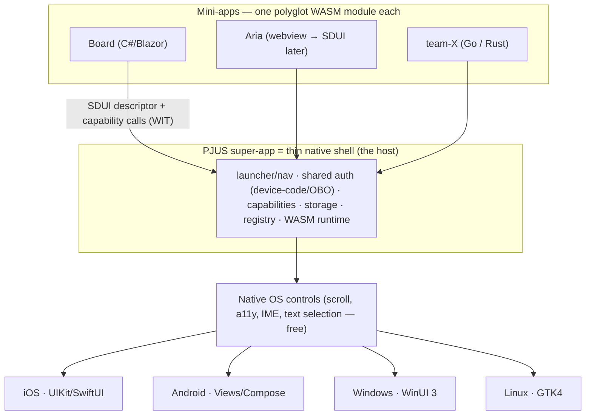

# Mabel Framework

> [Leia em Português / Read in Portuguese](README.pt-BR.md)

**Mabel is a polyglot super-app platform.** One app ships to the device; its features are
**WASM mini-apps** — one per project/team — that a **thin native shell** renders as **real
native OS controls**. Each team writes in its own language; every mini-app speaks the same
semantic UI contract. **No WebView. No canvas re-implementation of the OS. And no Mac
required to ship to iPhone.**

---

## The big picture: the PJUS super-app platform

> **Each PJUS project/team ships its mini-app; the PJUS super-app renders them all.**

There is **one PJUS app** on the device. Its features are not hard-coded screens — they
are independent **mini-apps** (each a WASM module + a UI descriptor), owned by different
teams, that the shell loads and renders. Adding or fixing a feature means publishing a new
mini-app, **without reinstalling** the app (see [OTA](docs/ota.md)).

**Pillars:**

- **One app, many features.** PJUS is the app; Board, Aria, and whatever each team builds
  are mini-apps inside it. They grow without going through the store again.
- **Polyglot per team.** Each team in its own stack — Opera in .NET/Blazor, another in
  Go/Rust — and **all emit the same SDUI descriptor**. The platform democratizes; it does
  not force .NET on anyone (see [polyglot authoring](docs/autoria-poliglota.md)).
- **Shared by the super-app.** Identity/auth (device-code/OBO — log in **once**, every
  mini-app inherits it), capabilities (camera/GPS/notifications via WIT), storage, and the
  launcher/navigation across mini-apps.
- **Sandboxed per mini-app.** Each mini-app runs isolated in its own WASM sandbox — one
  project can't read another's memory or break it; authority is only what the manifest
  grants. The right security model for many teams' code in one app.
- **Registry of mini-apps.** The shell lists and loads the published mini-apps — baked
  into the build (App-Store-safe) or dynamic internally (enterprise/MDM).

Full design: **[docs/super-app.md](docs/super-app.md)** · **[ADR 0005](docs/adr/0005-super-app.md)**.

---

## The mechanism: WASM as the "universal DLL"

A DLL is a compiled artifact any program can load and call through a stable ABI, whatever
language wrote it. Mabel applies that to **whole apps**:

> **A mini-app is one `.wasm` module.** Language-agnostic (polyglot), sandboxed, portable.
> The shell loads it and speaks two contracts with it: a **UI descriptor** (what to show)
> and a **capabilities ABI** (what the device can do). The shell renders the descriptor
> with the platform's own native controls.



---

## How it works, end to end

1. **You author UI** in a high-level language. On the .NET path that's **Blazor/Razor**
   (`.razor`) driven by a custom renderer that emits a descriptor instead of HTML.
2. **It compiles to a WASM module** — sandboxed, portable, no browser runtime.
3. **The mini-app emits an SDUI descriptor** — a *semantic tree of controls* ("a scrollable
   list of cards, each with a title and a progress bar"), **not** a pixel display-list.
4. **The shell loads the module** and walks the descriptor with a `MabelViewBuilder`,
   instantiating **real native controls** of that OS.
5. **Interaction flows back semantically:** a tapped control returns `{action, id, data}`
   — never pixel coordinates. Scroll, focus, accessibility, text selection, IME and dynamic
   type come **for free** because they are genuine OS controls.
6. **The mini-app reaches the device** via capabilities: a WIT-defined ABI mediates camera,
   GPS, notifications, biometrics, secure storage, share, clipboard, haptics.

### SDUI: semantic descriptor → native controls (not canvas, not WebView)

Other frameworks either re-implement the whole UI stack on a canvas (Flutter) or wrap a
WebView (Ionic, Tauri). Mabel does neither: it sends a **semantic description** and lets
each OS render it natively. The descriptor is a versioned tree
(`Mabel.Wasi.Protocol/Sdui/Descriptor.cs`) with 13 node types (v1):

`Screen · VStack · HStack · ScrollView · List · Card · Text · Button · Image · Badge ·
ProgressBar · Divider · Spacer`

Each node has a **stable semantic `Id`** (e.g. `card:50231`), flex-like layout props,
box/text styling, and an optional `OnTap` action. See **[ADR 0001](docs/adr/0001-sdui-descriptor.md)**.

### No Mac, ever — iOS via xtool

Shipping to iPhone normally requires a Mac (Xcode). Mabel's hard constraint is **no Mac —
as a principle, zero Apple toolchain** (not merely "don't buy a Mac"). That rejects MAUI,
Flutter, Compose Multiplatform, Uno, and BlazorBindings.Maui for iOS — all need Mac/Xcode.
Instead the iOS host is **hand-rolled Swift (UIKit/SwiftUI)**, built and signed from
Linux/WSL with **[xtool](https://github.com/xtool-org/xtool)**. A hello-world IPA has
already been built and deployed this way.

### Runtimes: what actually runs on the device

iOS forbids JIT, and a spike (task #17, v2) proved exactly what runs where — **on device,
no Mac.** An app can load **both** iOS runtimes at once (see below):

| | Runtime | JIT? | HMR? | Guest language on device | Status |
|---|---|---|---|---|---|
| **iOS (dev & live)** | **WasmKit** (pure-Swift interpreter) | No | Yes | **lean core-wasm only** (Rust/TinyGo/AssemblyScript/C) | **PROVEN on device, no Mac** |
| **iOS (release, fast)** | **wasm2c → C → xtool clang → arm64** (AOT) | AOT | No | lean core-wasm | **PROVEN on device, no Mac (~163× vs interp)** |
| **Desktop** | wasmtime (Cranelift JIT) | Yes | Yes | broad, **incl. .NET/Blazor** | designed |
| **Android** | wasmtime-JNI / Chicory (JIT) | Yes | Yes | broad | designed |

Both iOS paths ran **side by side in the same app on the crow5 iPhone**, cross-compiled and
installed from Linux with no Mac. The AOT path is **~163×** faster than the interpreter on a
trivial benchmark (heavy compute lands ~10–50×).

> **Important, honest finding (spike):** **`.NET → wasm` does not run on WasmKit.** .NET
> emits a WASI-Preview-2 Component + Mono (~3.34 MB); WasmKit is a core-module + Preview-1
> runtime → format mismatch, rejected (maxed size flags don't help — the weight is the Mono
> runtime, and `wasm-opt` rejects the component). A Rust core module, by contrast, is ~55 B
> and runs. So the **live on-device guest on iOS is a lean core-wasm language** (Rust/TinyGo/
> AssemblyScript/C), not .NET. **`NativeAOT-LLVM` is the right .NET-on-device path but is
> blocked in WSL today** (experimental SDK + ~1 GB emsdk) → its own phase. **.NET/C#/Blazor's
> role is authoring, build-time descriptor generation** (e.g. `board_gen` runs at build/WSL
> and emits descriptor JSON — how today's proven iOS screen works; the Blazor renderer runs
> headless/no-browser, HtmlRenderer/BlazorBindings precedent) **and desktop/Android** (JIT
> runtimes that run .NET-wasm). The polyglot promise is real, with this per-platform asterisk.

### Targets — four host families

- **Mobile:** **iOS** (UIKit/SwiftUI host, via xtool) and **Android** (Views/Compose host).
- **Desktop:** **Windows** (WinUI 3) and **Linux** (GTK4). Desktop is the **primary HMR
  loop** (JIT, no device). See **[docs/desktop.md](docs/desktop.md)** / **[ADR 0004](docs/adr/0004-desktop.md)**.
- **Web:** a **web host renders the same descriptor to DOM / web-components** — a real
  first-class target, not just a preview. Runs the guest on the browser's native WASM
  runtime; device-only capabilities (camera/GPS) are **mocked** in the web host for dev.
- **To confirm:** **macOS-desktop** — no-Mac build is plausible but not a paved xtool path
  yet; needs a spike (task #21).

Same descriptor everywhere, **rendered per platform** — native looks native, web looks web.
It is **not** pixel-identical across targets, by design: that's the point of SDUI (same
screen, structure, and behavior; each platform's own look).

---

## Super-app architecture

The shell is a **multi-module host**: it loads and manages the lifecycle of **several**
mini-apps (load on demand, unload, hot-swap), each emitting its own SDUI descriptor, all
rendered by the same native controls. It provides **shared services** — identity/auth,
capabilities, storage (shared + per-mini-app), navigation, and shell-mediated messaging
between mini-apps (they never see each other directly; the sandbox holds).

**Isolation is a guarantee by design:** publishing or updating one mini-app (e.g. Opera)
**cannot break another** (e.g. Aria) — separate WASM sandbox + isolated linear memory + its
own descriptor + error boundary + independent version in the registry. It's an architectural
property, **designed, not yet implemented** (depends on the multi-module host + WASM-live).

**Incorporating Aria:** the fast path is a **webview mini-app** (Aria is already web →
hosted in a `WKWebView`/`WebView2` alongside the SDUI-native mini-apps, reusing today's web
with the shell's auth/capabilities), migrating to SDUI-native later. A **mixed** super-app
(some mini-apps SDUI-native, some webview) is supported. The webview here is an optional
per-mini-app shell, **not** the app's architecture — the "no WebView" thesis holds for
Mabel-native.

Full design: **[docs/super-app.md](docs/super-app.md)** · **[ADR 0005](docs/adr/0005-super-app.md)**.

---

## Runtime updates / OTA

Because the shell is stable and mini-apps are content, features can ship **over the air**.
Three levels (full design: **[docs/ota.md](docs/ota.md)** · **[ADR 0006](docs/adr/0006-ota.md)**):

| Level | What changes | New logic? | Internal OTA | Public App Store |
|---|---|---|---|---|
| **1. Descriptor-only** | UI/content (the SDUI tree, text, layout, data) | No — pure data | ✅ always safe | ✅ fine (data, not code) |
| **2. Mini-app WASM (logic)** | a new/updated `.wasm`, run by the **interpreter** | Yes | ✅ free | ⚠️ gray (see below) |
| **3. Native shell** | the host/app itself | Yes (native) | ❌ store only | ❌ store only |

**Both runtimes coexist in one app (this is the key):** an app ships a **baked AOT core**
(wasm2c→native — fast, offline, store-clean) **and** the **WasmKit interpreter** for OTA'd
mini-apps/logic — it is **not** either/or. So you keep WASM fast (baked) *and* get OTA
(descriptor always + interpreted wasm-logic). Both paths were proven side by side on device.

**The AOT-vs-OTA tension (honest physics):** for any *one* piece of code, "native speed +
OTA of *new* logic + public App Store" cannot all hold at once — fast = baked = no OTA;
OTA = interpreted = public-gray. **Internal PJUS has no such limit.** And **descriptor-OTA**
(instant, always store-safe) covers the bulk of change regardless. Strategy: **baked AOT
core** (fast/store) + **interpreter for OTA'd mini-apps** (internal) + **descriptor-OTA
always** (fastest, safest, any channel).

**Policy, honestly:** PJUS **enterprise/internal/MDM** = OTA is free (no App Review).
**Public App Store** guideline **2.5.2** restricts downloading executable code; **JS has an
explicit carve-out** (JSCore — why RN/CodePush/WeChat can), **WASM run by your own
interpreter does not → gray zone.** Safe public paths: descriptor-OTA + webview mini-app +
AOT-baked mini-apps.

---

## Store-safety: the DATA vs CODE line (two tiers)

Apple's line is simple — **data is free, downloaded code is not.** That collapses the
levels above into two tiers of store-safety:

- **Tier 1 — pure SDUI (store-safe *and* instant):** native host + a **baked
  component/action library** + a **server-driven descriptor (DATA)**. The server sends the
  descriptor; the app renders native controls and runs **named actions it already knows**
  (baked). Zero downloaded code → zero 2.5.2. New screens/layout/content = **instant OTA,
  unlimited, no review** (the Airbnb/Spotify SDUI model). It may need **no WASM on device
  at all**.
- **Tier 2 — portable logic / behavior (WASM):** only for genuinely new behavior beyond the
  baked vocabulary. **AOT-baked (wasm2c→native) = 100% store-clean** (reviewed as a native
  binary), no OTA; or **interpreted (WasmKit) = OTA**, gray in public / fine internally.

**Strategy:** invest in a rich baked action/component vocabulary so most updates are just a
new descriptor (data) — instant and store-clean forever; reserve WASM-live for new behavior.
See **[docs/ota.md §5](docs/ota.md)**.

## Offline model

- **WASM is the offline engine.** With local WASM, logic runs on device: it produces the
  descriptor from local state, handles events, and computes **offline**. Without WASM
  (server-driven only), offline is **read-only cache** (cached descriptor + data + baked
  native actions) — custom offline logic has nowhere to run.
- **Hybrid (recommended):** online = server SDUI (fresh/instant/OTA); cache the descriptor +
  data **+ the WASM module**; offline = run the cached WASM → a genuinely functional app;
  sync on reconnect.
- **Simplest:** **AOT-baked WASM = offline by construction** (it's in the binary) + server
  descriptors for online freshness on top = best of both.
- **Rule:** thin app (just shows server data) → you can skip WASM (cache + native, read-only
  offline). Truly offline/interactive app → keep WASM as the local engine (baked
  recommended). See **[docs/ota.md §6](docs/ota.md)**.

---

## Polyglot authoring

**The contract is the SDUI descriptor + WIT — not Blazor.** Blazor is just C#'s idiomatic
way to produce the descriptor. Three layers (full design:
**[docs/autoria-poliglota.md](docs/autoria-poliglota.md)** · **[ADR 0007](docs/adr/0007-autoria-poliglota.md)**):

1. **Single source = WIT/schema** (descriptor + capabilities, `package mabel:*`).
2. **Codegen (wit-bindgen) generates types + capability bindings per language** (C#, Go,
   Rust) — the bulk of "speaking the protocol" is generated, not hand-written.
3. **Idiomatic authoring sugar per language:**
   - **C# (flagship):** Blazor/Razor + a custom renderer → descriptor (referencing a fork
     of **BlazorBindings**, retargeting its MAUI backend to SDUI — **not** MAUI).
   - **Go:** idiomatic builders (`VStack(Card(...))`) or a templ/gomponents-style lib;
     TinyGo→wasm.
   - **Rust:** macros/RSX, or adapt Dioxus/Leptos (already produce a virtual tree); Rust→wasm.

A **thin per-language guest SDK** (generated types + render loop + sugar) sits on a
**shared core** (host/renderer/capabilities/shell). Priority: **C#/Blazor first** (team
Opera, best DX); Go/Rust enabled by publishing the WIT + generator. The architecture
**permits** all three; it does not require all three on day one. (On-device caveat: the
live iOS guest is a lean-lang, not .NET — see the runtime table above.)

---

## Capabilities

Mini-apps are sandboxed (no direct OS access). Native device APIs are reached through a
**capability-based ABI**, modeled in **WIT** (`Mabel.Wasi.Protocol/Capabilities/wit/`,
`package mabel:capabilities`) as the north-star, with the **real wire being a flattened
WASI-Preview-1 core-module** today. Key points (**[ADR 0002](docs/adr/0002-capabilities-abi.md)**,
**[docs/capabilities-abi.md](docs/capabilities-abi.md)**):

- **Async via request-id + single callback** (not Component Model futures — immature on
  this stack): the guest passes a `reqId`, gets an immediate status, and the host later
  calls one export `mabel_on_capability_result(reqId, …)` → the guest resolves a
  `TaskCompletionSource` for idiomatic `await`.
- **Security in two layers:** a **manifest** (host grants only declared capabilities —
  least authority by construction) plus the **OS consent prompt** at runtime.
- **Free Apple account** cuts push notifications and iCloud/shared keychain; notifications
  are local-only, secure storage is per-app.

---

## Hot Module Reload + state preservation

`mabel dev` watches files, recompiles the WASM, and signals the host over WebSocket; the
host then **hot-swaps** the module and re-renders. A swapped module gets fresh linear
memory, so in-guest state is lost unless transported. The layered answer
(**[docs/hmr-e-estado.md](docs/hmr-e-estado.md)** · **[ADR 0003](docs/adr/0003-hmr-e-estado.md)**):

- **Default — externalized state store (Elm/TEA):** app is `view(state)` + `update(state,
  action)`; state lives in a **host store** and survives the swap by construction. The only
  option that composes with hot-swap **and** polyglot guests, and it already matches SDUI.
- **Transport — snapshot** (`serialize_state`/`restore_state`) moves the opaque state blob
  across a swap.
- **.NET optimization — Roslyn Hot Reload** applies IL deltas in place for method-body
  edits (no swap, 100% preserved) — **desktop/Android only** (not iOS: WasmKit can't run
  .NET-wasm).
- **Fallback — full reload** when the state shape changed incompatibly.

Honest about what survives: **pure data** (screen/navigation/form/scroll/loaded models)
survives; **live OS bindings** (camera sessions, GPS streams, sockets, timers, in-flight
capability calls) do **not** — the host tears them down and the new module re-subscribes.

**Multi-target simultaneous HMR (the killer DX):** the dev-server broadcasts each rebuild
over WebSocket to **every connected host at once** — browser + device + desktop re-render
together on the same edit, with the externalized store surviving the diff. One edit, live
across all targets — the Flutter-multi-device loop, but via a shared descriptor.

---

## Desktop, and the toolkit decision

Desktop is a first-class target and the primary HMR loop (JIT runtime, no device). There
is **no single cross-desktop toolkit of native OS controls**, so the choice is explicit:

- **Native per-OS** (Windows = WinUI 3/Win32, Linux = GTK4/Qt, macOS = AppKit): 100% native
  controls, honoring the thesis — but one view-builder per OS.
- **Cross-desktop own-render toolkit** (Avalonia/Qt): one host, but it draws its own
  controls (Skia-like) — not the OS's controls, which breaks the "native controls" principle
  (the same reason the mobile canvas path was rejected).

**Decision (ADR 0004):** lean **native-per-OS where it matters — Windows and Linux first
(no Mac); macOS to confirm (Mac-less build spike).** Avalonia is allowed as a pragmatic
single-host **preview/scaffold** during bring-up, not as the destination. Runtime:
**wasmtime** (Cranelift JIT). See **[docs/desktop.md](docs/desktop.md)**.

### Distribution + auto-update (a real differentiator)

Split in two layers:

- **Content (WASM + descriptors): OTA from the server → shell reloads** — instant, tiny, no
  reinstall, no restart (hot-swap). **On desktop this is 100% free:** there is no mandatory
  store on Windows/Linux/macOS-direct, so the iOS 2.5.2 gray zone **does not exist** — OTA of
  both descriptors *and* wasm-logic is unrestricted.
- **Native shell (rare): the platform's standard updater** — Windows: MSIX / Squirrel.Windows;
  Linux: **AppImage + AppImageUpdate (delta/zsync)** / Flatpak / Snap / apt; macOS: **Sparkle**
  (⚠️ needs notarization — ties into the macOS spike via the `notarytool` API).

**Vs. the competition:** Electron/Tauri **re-download the whole binary** on every update
(electron-updater / Tauri updater); **Mabel re-downloads only the content** (KB, instant, no
close). Separating a rarely-changing shell from frequently-changing content is the win.

**Robustness:** stable/beta/canary channels + gradual rollout + rollback (keep the previous
version) + **signed updates** (verify the wasm/shell signature before applying — otherwise it
is an attack vector; needs key management).

**Honest:** the per-OS shell updater is real, standard work; macOS shell-update = Sparkle +
notarization (Apple tooling, reachable via API without a Mac — pending the spike).

---

## Debugging & DevTools

Debug is **multi-layer**, one tool per boundary (full design:
**[docs/debugging.md](docs/debugging.md)** · **[ADR 0008](docs/adr/0008-debugging.md)**):

1. **Logic (guest WASM)** — debug on the **desktop/build host** (full runtime, normal
   debugger); the logic is the same one that runs on device.
2. **Descriptor (SDUI tree)** — a **descriptor inspector** (tree, live props, frame diff,
   time-travel) — React-DevTools/Flutter-inspector style; trivial because the descriptor is
   pure data.
3. **Native render** — **select-mode**: tap a native view → the source SDUI node (`Id`).
4. **Guest↔host wire** — a **wire inspector** (the protocol's "Network tab": descriptors,
   tap events, capability calls with `reqId`/streams traced).

**Mabel-specific leverage:** the **web host + browser DevTools is the primary debug
surface** (the same descriptor runs on web and native via multi-target HMR → debug in Chrome
DevTools, faithful to native, reusing mature tooling); **deterministic replay** (app =
descriptor + WASM + externalized state → capture and re-run → reproduce the bug from data);
**error boundaries** (a node/guest error isolates to the mini-app/subtree — doesn't take down
the super-app — with a dev error overlay).

**Honest status:** today debugging is **`NSLog` via `idevicesyslog`** (how the on-device tap
was validated) — primitive. The mature toolset (inspector/wire/replay/boundaries) is
🟢-tier, **wave 4** of the roadmap (task #20).

---

## Status — honest, per platform

Legend: **PROVEN** (runs, validated) · **DESIGNED** (spec/ADR, not built) · **TODO** (not
started) · **TO CONFIRM** (plausible, needs a spike) · **BLOCKED** (external blocker).

The **SDUI descriptor contract** and the **capabilities WIT** are platform-neutral and
shared: contract **DESIGNED (v1 committed)**. Per-platform pieces:

| Layer | iOS | Android | Windows | Linux | macOS | Web |
|---|---|---|---|---|---|---|
| Host renders descriptor → native controls | **PROVEN**¹ | DESIGNED | DESIGNED | DESIGNED | TO CONFIRM² | DESIGNED (→DOM) |
| WASM runtime (live guest on device) | **PROVEN** (WasmKit interp + wasm2c AOT)³ | DESIGNED (JIT) | DESIGNED (wasmtime) | DESIGNED (wasmtime) | TO CONFIRM² | DESIGNED (browser-native) |
| Capabilities (WIT ABI) | DESIGNED | DESIGNED | DESIGNED | DESIGNED | TO CONFIRM² | DESIGNED (mocked) |
| Build without a Mac | **PROVEN** (xtool) | N/A | N/A | N/A | TO CONFIRM² | N/A |
| HMR (hot reload) | DESIGNED (WasmKit swap) | DESIGNED | DESIGNED (primary loop) | DESIGNED (primary loop) | TO CONFIRM² | DESIGNED (broadcast) |
| Super-app shell (multi mini-app) | DESIGNED | DESIGNED | DESIGNED | DESIGNED | TO CONFIRM² | DESIGNED |

¹ descriptor → UIKit with native **card-flash + scroll validated on device**, plus 5 taps
logging `[Board] open-card card:X` across columns (the Board proof, confirmed by Daniel).
² **macOS-desktop = to confirm, not blocked:** no-Mac build is plausible via cross-compile
Swift/AppKit + `apple-codesign`/`rcodesign` + notarization API, but it is not a paved xtool
path yet → needs a spike (task #21).
³ **both proven on device, no Mac:** WasmKit interpreter (dev/OTA) **and** wasm2c→arm64 AOT
(release, ~163× faster) ran side by side. **lean core-wasm only** (Rust/TinyGo/AssemblyScript/
C); **.NET-wasm is not supported on WasmKit** — .NET is for authoring, build-time descriptor
generation, and desktop/Android. Web runs the guest on the browser's native WASM engine.

---

## How Mabel compares

The goal: take the best of each framework and mitigate what didn't work. Frameworks as
columns, dimensions as rows. Tokens: ✅ good · ⚠️ partial/caveat · ❌ weak/absent.
(Table scrolls horizontally.)

| Dimension | Flutter | React Native | .NET MAUI | Compose MP | KMP | Uno | Tauri | Electron | Capacitor/Ionic | NativeScript | Qt | Avalonia | SwiftUI (native) | **Mabel** |
|---|---|---|---|---|---|---|---|---|---|---|---|---|---|---|
| Language(s) | Dart | JS/TS | C# | Kotlin | Kotlin | C# | Rust+web | JS+web | JS+web | JS/TS | C++ | C# | Swift | **any→WASM** |
| Render model | own canvas (Skia) | native controls | native controls | own (Skia)⁺ | per-platform native | WinUI XAML | webview | webview | webview | native controls | own (widgets) | own (Skia) | native controls | **native controls (SDUI)** |
| Native feel / a11y | ⚠️ engine-drawn | ✅ | ✅ | ⚠️ | ✅ | ✅ | ❌ webview | ❌ webview | ❌ webview | ✅ | ⚠️ | ⚠️ own-render | ✅ | ✅ |
| iOS build without a Mac | ❌ | ❌ | ❌ | ❌ | ❌ | ❌ | ❌ | n/a (desktop) | ❌ | ❌ | ❌ | ❌ | ❌ | **✅ (xtool)** |
| Targets | iOS/Android/web/desktop | iOS/Android(+desktop) | iOS/Android/desktop | iOS/Android/desktop/web | iOS/Android(+) | all | desktop(+mobile beta) | desktop | iOS/Android/web | iOS/Android | all | desktop(+mobile) | Apple only | **iOS/Android/Win/Linux** |
| App size | ⚠️ large (engine) | ⚠️ medium (JS) | ⚠️ medium | ⚠️ large | ✅ (logic only) | ⚠️ | ✅ tiny | ❌ huge | ⚠️ | ⚠️ | ⚠️ | ⚠️ | ✅ | **✅ tiny (lean guest)** |
| Startup / perf | ✅ | ⚠️ (bridge) | ✅ | ✅ | ✅ | ✅ | ✅ | ❌ | ⚠️ | ⚠️ | ✅ | ✅ | ✅ | ✅ AOT / ⚠️ interp |
| HMR / hot reload | ✅ | ✅ | ⚠️ | ✅ | ⚠️ | ⚠️ | ⚠️ | ✅ | ✅ | ✅ | ⚠️ | ✅ | ✅ (previews) | ✅ (desktop primary) |
| OTA without store | ❌ | ✅ CodePush (JS) | ❌ | ❌ | ❌ | ❌ | ⚠️ web assets | ✅ | ✅ web | ⚠️ | ❌ | ❌ | ❌ | ✅ descriptor / ⚠️ WASM |
| Polyglot | ❌ | ❌ | ❌ | ❌ | ❌ | ❌ | ⚠️ (web) | ⚠️ (web) | ⚠️ (web) | ❌ | ❌ | ❌ | ❌ | **✅ (any→WASM)** |
| Sandbox / security | ❌ | ❌ | ❌ | ❌ | ❌ | ❌ | ⚠️ | ❌ | ⚠️ | ❌ | ❌ | ❌ | ❌ | **✅ (WASM per mini-app)** |
| Super-app / mini-apps | ❌ | ⚠️ | ❌ | ❌ | ❌ | ❌ | ❌ | ❌ | ❌ | ❌ | ❌ | ❌ | ❌ | **✅** |
| Offline | ✅ | ✅ | ✅ | ✅ | ✅ | ✅ | ✅ | ✅ | ⚠️ | ✅ | ✅ | ✅ | ✅ | ✅ (WASM local) |
| DX / learning curve | ✅ | ✅ | ✅ | ✅ | ⚠️ | ⚠️ | ⚠️ | ✅ | ✅ | ✅ | ⚠️ | ✅ | ✅ | ⚠️ early |
| Maturity / ecosystem | ✅ | ✅ | ✅ | ⚠️ | ✅ | ⚠️ | ✅ | ✅ | ✅ | ⚠️ | ✅ | ⚠️ | ✅ | ❌ **new** |
| Store policy fit | ✅ | ✅ | ✅ | ✅ | ✅ | ✅ | ✅ | ✅ | ✅ | ✅ | ✅ | ✅ | ✅ | ✅ (AOT/descriptor) / ⚠️ WASM-OTA public |

⁺ Compose renders its own surface everywhere except Android, where it is native.

### What Mabel takes from each — and what it mitigates

- **Flutter** — takes: hot reload, single codebase, rich widgets. Mitigates: own-canvas
  (weaker a11y/feel), Dart-only, large engine, iOS needs a Mac.
- **React Native** — takes: native controls, OTA (CodePush), the Fabric/JSI direction.
  Mitigates: old-bridge jank, JS-only, iOS needs a Mac.
- **.NET MAUI / Uno** — takes: declarative C#, native controls. Mitigates: iOS needs a Mac,
  C#-only.
- **Compose Multiplatform** — takes: modern declarative UI. Mitigates: own-canvas off
  Android, Kotlin-only, iOS needs a Mac.
- **Kotlin Multiplatform** — takes: shared native logic, small size. Mitigates: UI not
  shared (per-platform), Kotlin-only, iOS needs a Mac.
- **Tauri** — takes: tiny size, web reuse, Rust core. Mitigates: webview (not native),
  webview quirks.
- **Electron / Capacitor / Ionic / NativeScript** — takes: web reuse, fast onboarding.
  Mitigates: heavy webview / non-native feel (NativeScript is native but mobile-only).
- **Qt / Avalonia** — takes: cross-platform desktop, mature (Qt). Mitigates: own-render
  (not OS controls), C++ (Qt), iOS/Mac gaps.
- **SwiftUI (native)** — takes: the gold standard for native feel/a11y (the bar Mabel
  renders to). Mitigates: Apple-only, Swift-only, needs a Mac.

**Synthesis (Mabel):** native controls (like RN/native, not a canvas) + **no Mac (unique)**
+ **polyglot WASM (no one else)** + super-app/mini-apps + OTA + tiny (lean guest) + offline
(local WASM). It takes the best and avoids the dominant pains.

**Where Mabel loses today (honest):** **maturity/ecosystem** (brand new — no plugin
ecosystem, few samples), **DX** (tooling still thin), and the **roadmap tail** below
(theming, i18n, animations, component breadth, devtools). The hard/differentiated parts are
done or designed; the tail is known work.

Trade-off on expressiveness: SDUI's power is bounded by its node set. Bespoke visuals
(custom-drawn charts, game-like UI) would need a schema extension or a `Canvas` escape node
— out of scope for v1. Mabel targets control-based app UI (forms, lists, boards, dashboards).

---

## Current status — proven vs. in design

**Proven / working (on device, no Mac):**
- CLI (`mabel`, .NET 10 AOT), dev server (file-watch + WebSocket reload), renderer with a
  green test suite.
- iOS IPA **built and deployed from Linux without a Mac** via xtool (hello-world).
- **SDUI descriptor → native UIKit on a physical iPhone** (ADR 0001): card-flash + native
  scroll + 5 taps logging `[Board] open-card card:X` across columns (confirmed by Daniel).
- **Both iOS WASM runtimes on device** (spike #17 v2): **WasmKit** interpreter (pure-Swift,
  arm64, ~4.6 MB; pin `swift-system` 1.5.0) **and** **wasm2c→arm64 AOT** via xtool's clang,
  side by side, **~163×** AOT-vs-interp on a trivial bench. Runs **lean core-wasm** (Rust
  core ~55 B); **.NET-wasm rejected** (Preview-2/Mono ~3.34 MB vs core-module/Preview-1;
  `NativeAOT-LLVM` is the fix but blocked in WSL → own phase).
- Original pixel display-list render on iOS (Core Graphics) — the spike that motivated the
  SDUI pivot. Kept for reference, **superseded** by SDUI.

**In design (this consolidation + sibling branches):**
- iOS view-builder drafted on `feat/sdui-descriptor`; Android/desktop/web hosts and the
  super-app shell not built yet.
- **Capabilities ABI** (ADR 0002 — task #22), **HMR + state** (ADR 0003), **Desktop**
  (ADR 0004), **Super-app** (ADR 0005), **OTA** (ADR 0006), **Polyglot authoring** (ADR 0007).

**ADR index:** [0001 SDUI](docs/adr/0001-sdui-descriptor.md) ·
[0002 Capabilities](docs/adr/0002-capabilities-abi.md) ·
[0003 HMR + state](docs/adr/0003-hmr-e-estado.md) ·
[0004 Desktop](docs/adr/0004-desktop.md) ·
[0005 Super-app](docs/adr/0005-super-app.md) ·
[0006 OTA](docs/adr/0006-ota.md) ·
[0007 Polyglot authoring](docs/adr/0007-autoria-poliglota.md) ·
[0008 Debugging](docs/adr/0008-debugging.md)

> Note: ADRs 0001/0002 live on their own feature branches (`feat/sdui-descriptor`,
> `feat/mabel-capabilities-abi`); 0003–0007 and this README are on
> `feat/mabel-arch-consolidation`. Links resolve once the branches are integrated.

---

## Roadmap — what's left to be a mature framework

Honest tail. The differentiated/hard parts (no-Mac, WASM-as-DLL, super-app, store-safe OTA,
polyglot, SDUI→native) are **done or designed**; the rest is known framework work, grouped
by when it must be tackled.

**🔴 Design early (architectural — hard to retrofit):**
- **Schema versioning + host↔descriptor compatibility** (critical for OTA: an old host must
  render a newer descriptor with graceful degradation).
- **Navigation / routing** (stack, tabs, back, deep links).
- **Accessibility *in the descriptor*** (label/role/hint in the schema — otherwise the
  "free native a11y" never materializes).
- **Responsive / adaptive layout** (sizes, rotation, desktop resize, safe-area, density/DPI).
- **Lists / virtualization** (lazy, recycling, data windowing).

**🟡 Maturity:** theming / design-system (light/dark, tokens, Material/Cupertino); i18n / RTL
(⚠️ tension with `InvariantGlobalization`, which keeps the guest small); animations / gestures
(swipe/drag/transitions); forms / input / validation / focus; component catalog (beyond the
13 types: sheets, dialogs, date-picker); media (image/video/audio); lifecycle / background.

**🟢 Ecosystem / DX:** devtools / inspector + profiler; testing (unit / widget / e2e over
descriptor + hosts); error boundaries / crash-reporting / observability (New Relic);
CI / per-platform distribution.

This tail is tracked as task #20 (implement in waves: 🔴 → 🟡 → 🟢).

---

## FAQ

**Isn't this a mini-React-Native? Is there a slow bridge?**
No slow bridge. The native host owns the fast loop, calls are in-process, and re-renders are
diffed — not a per-frame serialized bridge. The guest emits a semantic descriptor, not a
chatty stream of UI mutations.

**Where's WASM/WASI on mobile?**
It's the app's **logic engine on device** — WasmKit interpreter in dev, wasm2c→native in
release, both proven on iPhone without a Mac.

**Does WASM run without being slow on iOS?**
Yes: dev = interpreter (fine for editing), release = wasm2c→native (~163× faster, proven).

**Can I use Go/Rust instead of .NET?**
Yes — the guest is polyglot core-WASM (a Rust core is ~55 B). Note: .NET/Mono-wasm does
**not** run on WasmKit, so the *live on-device* guest is a lean language; .NET is for
authoring, build-time, and desktop.

**Is writing a screen hard — a new DSL?**
No. You author in Blazor/Razor → custom renderer → descriptor (or Go builders / Rust macros).
No new DSL to learn.

**Can't it just map to Blazor?**
Yes — a custom Blazor renderer emits SDUI (runs headless, no browser).

**Do MAUI / BlazorBindings.Maui help?**
Not for iOS (they need a Mac). BlazorBindings is only a *renderer reference*.

**How does it reach native APIs / Bluetooth?**
Through the WIT capability bridge implemented by the native host; BLE fits the async
`reqId` + stream model.

**Does HMR work? What about state?**
Yes — the host hot-swaps the wasm and re-renders; state survives because it's externalized in
a host store; and HMR broadcasts to all targets at once (web + native together).

**Can it update without the store / work offline?**
OTA: descriptor always, wasm-logic internally (public store is gray). Offline: local WASM is
the engine (AOT-baked = offline by construction).

**Are macOS / desktop covered?**
Windows + Linux are designed (native controls, primary HMR loop). macOS without a Mac is a
spike — "to confirm", not promised.

**How do I debug it?**
Four layers (logic / descriptor / render / wire) + browser DevTools as the primary surface +
deterministic replay + error boundaries. Today it's `NSLog`; the rich tooling is wave 4.

**Super-app: can one mini-app break another?**
No — separate WASM sandbox, isolated memory, its own descriptor, an error boundary, and an
independent version in the registry. Isolation is a guarantee by design.

**Tiny footprint like Tauri?**
Yes — a lean guest (KB) with no webview engine bundled.

---

## Project structure

```
mabel-framework/
  Mabel.sln
  src/
    Mabel.Wasi.Protocol/       # Contracts guest<->host
      Protocol.cs              #   legacy pixel display-list (reference; superseded by SDUI)
      Sdui/Descriptor.cs       #   SDUI semantic tree (13 node types)  [ADR 0001]
      Capabilities/            #   WIT + flattened core-module ABI     [ADR 0002]
    Mabel.Renderer/            # ICanvas + MabelRenderer (legacy display-list path)
    Mabel.Core/                # Features, Ports, Infrastructure (vertical slice + hexagonal)
      Features/DevServer/      #   HTTP + WebSocket hot-reload server
    Mabel.Cli/                 # `mabel` CLI (AOT)
    Mabel.Host.Ios/            # Swift host (UIKit view-builder + WasmKit runtime)
  docs/
    adr/0001..0008             # architecture decision records
    sdui-*, capabilities-abi.md, hmr-e-estado.md, desktop.md, super-app.md, ota.md,
    autoria-poliglota.md, debugging.md
  samples/                     # hello-world, hello-world-ios
  tests/                       # Mabel.Core.Tests, Mabel.Renderer.Tests
```

Architecture: **vertical slice** (each feature self-contained under `Features/`) +
**hexagonal/ports-adapters** (all I/O behind `IShellExecutor`/`IFileSystem`; fakes in
tests). Only two .NET app projects: `Mabel.Core` and the thin `Mabel.Cli`.

## CLI

```bash
mabel doctor            # Check environment (tools, PATH, WSL detection)
mabel setup             # Install deps (.NET 10, Swift, xtool, WasmKit, wasmtime)
mabel create <name>     # Scaffold a new Mabel project
mabel deploy [path]     # Build and run on a device/emulator
mabel dev [path]        # Dev server with hot reload (Expo-style)
mabel devices           # List connected devices
mabel usb-help          # USB setup guide for physical devices
mabel version
```

Options: `--platform/-p` (`ios`|`android`|`desktop`|`all`), `--bundle-id/-b`,
`--port/-P` (default 5555), `--verbose`.

## Getting started

```bash
git clone https://github.com/dmarquezbh/mabel-framework.git
cd mabel-framework
chmod +x setup.sh && ./setup.sh          # .NET 10, Swift, xtool, wasm runtimes, USB tooling
export PATH="$HOME/.dotnet:$PATH"
dotnet run --project src/Mabel.Cli -- doctor
dotnet build && dotnet test
```

Developed and tested on **Linux / WSL2** (Ubuntu). For iOS-from-Linux over USB, see
`mabel usb-help`.

## Technology stack

- **.NET 10** — CLI (AOT), Blazor authoring, build-time descriptor generation, renderer,
  protocol, desktop host
- **WASM/WASI** — the mini-app module; **WasmKit** (iOS live interpreter, lean-lang guests),
  **wasmtime** (desktop/Android JIT, incl. .NET-wasm)
- **WIT** — descriptor + capability contracts (`package mabel:*`), wit-bindgen codegen
- **Swift** (UIKit/SwiftUI) — iOS host · **WinUI 3 / GTK4** — desktop hosts
- **xtool** — iOS build & deploy from Linux (no Mac)
- **xunit v3** — tests

## Contributing

Contributions welcome — open an issue or PR. Architecture decisions are recorded as ADRs
under `docs/adr/`; read the relevant ADR before proposing changes to a subsystem.

## License

MIT
