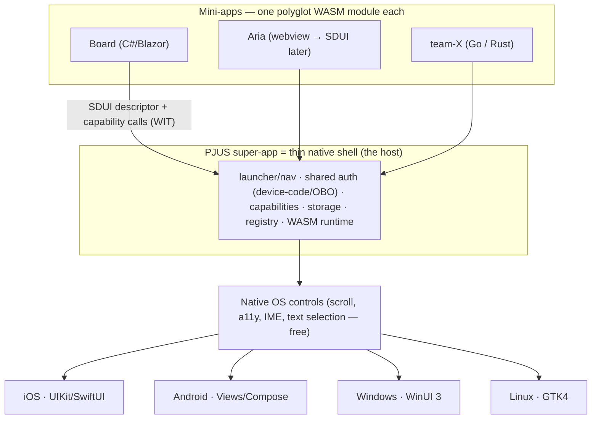

# Mabel Framework

> [Leia em Português / Read in Portuguese](README.pt-BR.md)

**Mabel is a polyglot super-app platform.** One app ships to the device; its features are
**WASM mini-apps** — one per project/team — that a **thin native shell** renders as **real
native OS controls**. Each team writes in its own language; every mini-app speaks the same
semantic UI contract. **No WebView. No canvas re-implementation of the OS. And no Mac
required to ship to iPhone.**

---

## The big picture: the PJUS super-app platform

> **Each PJUS project/team ships its mini-app; the PJUS super-app renders them all.**

There is **one PJUS app** on the device. Its features are not hard-coded screens — they
are independent **mini-apps** (each a WASM module + a UI descriptor), owned by different
teams, that the shell loads and renders. Adding or fixing a feature means publishing a new
mini-app, **without reinstalling** the app (see [OTA](docs/ota.md)).

**Pillars:**

- **One app, many features.** PJUS is the app; Board, Aria, and whatever each team builds
  are mini-apps inside it. They grow without going through the store again.
- **Polyglot per team.** Each team in its own stack — Opera in .NET/Blazor, another in
  Go/Rust — and **all emit the same SDUI descriptor**. The platform democratizes; it does
  not force .NET on anyone (see [polyglot authoring](docs/autoria-poliglota.md)).
- **Shared by the super-app.** Identity/auth (device-code/OBO — log in **once**, every
  mini-app inherits it), capabilities (camera/GPS/notifications via WIT), storage, and the
  launcher/navigation across mini-apps.
- **Sandboxed per mini-app.** Each mini-app runs isolated in its own WASM sandbox — one
  project can't read another's memory or break it; authority is only what the manifest
  grants. The right security model for many teams' code in one app.
- **Registry of mini-apps.** The shell lists and loads the published mini-apps — baked
  into the build (App-Store-safe) or dynamic internally (enterprise/MDM).

Full design: **[docs/super-app.md](docs/super-app.md)** · **[ADR 0005](docs/adr/0005-super-app.md)**.

---

## The mechanism: WASM as the "universal DLL"

A DLL is a compiled artifact any program can load and call through a stable ABI, whatever
language wrote it. Mabel applies that to **whole apps**:

> **A mini-app is one `.wasm` module.** Language-agnostic (polyglot), sandboxed, portable.
> The shell loads it and speaks two contracts with it: a **UI descriptor** (what to show)
> and a **capabilities ABI** (what the device can do). The shell renders the descriptor
> with the platform's own native controls.



---

## How it works, end to end

1. **You author UI** in a high-level language. On the .NET path that's **Blazor/Razor**
   (`.razor`) driven by a custom renderer that emits a descriptor instead of HTML.
2. **It compiles to a WASM module** — sandboxed, portable, no browser runtime.
3. **The mini-app emits an SDUI descriptor** — a *semantic tree of controls* ("a scrollable
   list of cards, each with a title and a progress bar"), **not** a pixel display-list.
4. **The shell loads the module** and walks the descriptor with a `MabelViewBuilder`,
   instantiating **real native controls** of that OS.
5. **Interaction flows back semantically:** a tapped control returns `{action, id, data}`
   — never pixel coordinates. Scroll, focus, accessibility, text selection, IME and dynamic
   type come **for free** because they are genuine OS controls.
6. **The mini-app reaches the device** via capabilities: a WIT-defined ABI mediates camera,
   GPS, notifications, biometrics, secure storage, share, clipboard, haptics.

### SDUI: semantic descriptor → native controls (not canvas, not WebView)

Other frameworks either re-implement the whole UI stack on a canvas (Flutter) or wrap a
WebView (Ionic, Tauri). Mabel does neither: it sends a **semantic description** and lets
each OS render it natively. The descriptor is a versioned tree
(`Mabel.Wasi.Protocol/Sdui/Descriptor.cs`) with 13 node types (v1):

`Screen · VStack · HStack · ScrollView · List · Card · Text · Button · Image · Badge ·
ProgressBar · Divider · Spacer`

Each node has a **stable semantic `Id`** (e.g. `card:50231`), flex-like layout props,
box/text styling, and an optional `OnTap` action. See **[ADR 0001](docs/adr/0001-sdui-descriptor.md)**.

### No Mac, ever — iOS via xtool

Shipping to iPhone normally requires a Mac (Xcode). Mabel's hard constraint is **no Mac —
as a principle, zero Apple toolchain** (not merely "don't buy a Mac"). That rejects MAUI,
Flutter, Compose Multiplatform, Uno, and BlazorBindings.Maui for iOS — all need Mac/Xcode.
Instead the iOS host is **hand-rolled Swift (UIKit/SwiftUI)**, built and signed from
Linux/WSL with **[xtool](https://github.com/xtool-org/xtool)**. A hello-world IPA has
already been built and deployed this way.

### Runtimes: what actually runs on the device

iOS forbids JIT, and a spike proved exactly what runs where:

| | Runtime | JIT? | HMR? | Guest language on device | Status |
|---|---|---|---|---|---|
| **iOS (dev & live)** | **WasmKit** (pure-Swift interpreter) | No | Yes | **lean core-wasm only** (Rust/TinyGo/AssemblyScript/C) | **PROVEN on device, no Mac** |
| **iOS (release, fast)** | wasm2c → C → arm64 (AOT) | AOT | No | lean core-wasm | aspirational (not proven) |
| **Desktop** | wasmtime (Cranelift JIT) | Yes | Yes | broad, **incl. .NET/Blazor** | designed |
| **Android** | wasmtime-JNI / Chicory (JIT) | Yes | Yes | broad | designed |

> **Important, honest finding (spike, task #17):** **`.NET → wasm` does not run on
> WasmKit.** .NET emits a WASI-Preview-2 Component + Mono; WasmKit is a core-module +
> Preview-1 runtime → format mismatch, rejected. So the **live on-device guest on iOS is a
> lean core-wasm language**, not .NET. **.NET/C#/Blazor's role is authoring, build-time
> descriptor generation** (e.g. `board_gen` runs at build/WSL and emits descriptor JSON —
> that's how today's proven iOS screen works) **and desktop/Android** (JIT runtimes that
> can run .NET-wasm). The polyglot promise is real, with this per-platform asterisk.

### Targets

- **Mobile:** **iOS** (UIKit/SwiftUI host, via xtool) and **Android** (Views/Compose host).
- **Desktop:** **Windows** (WinUI 3) and **Linux** (GTK4). Desktop is the **primary HMR
  loop** (JIT, no device). See **[docs/desktop.md](docs/desktop.md)** / **[ADR 0004](docs/adr/0004-desktop.md)**.
- **Deferred / blocked:** **macOS-desktop** (blocked by the no-Mac principle — enters later
  as just another host). **Web** (SDUI→DOM host) is conceptually possible but not pursued.

---

## Super-app architecture

The shell is a **multi-module host**: it loads and manages the lifecycle of **several**
mini-apps (load on demand, unload, hot-swap), each emitting its own SDUI descriptor, all
rendered by the same native controls. It provides **shared services** — identity/auth,
capabilities, storage (shared + per-mini-app), navigation, and shell-mediated messaging
between mini-apps (they never see each other directly; the sandbox holds).

**Incorporating Aria:** the fast path is a **webview mini-app** (Aria is already web →
hosted in a `WKWebView`/`WebView2` alongside the SDUI-native mini-apps, reusing today's web
with the shell's auth/capabilities), migrating to SDUI-native later. A **mixed** super-app
(some mini-apps SDUI-native, some webview) is supported. The webview here is an optional
per-mini-app shell, **not** the app's architecture — the "no WebView" thesis holds for
Mabel-native.

Full design: **[docs/super-app.md](docs/super-app.md)** · **[ADR 0005](docs/adr/0005-super-app.md)**.

---

## Runtime updates / OTA

Because the shell is stable and mini-apps are content, features can ship **over the air**.
Three levels (full design: **[docs/ota.md](docs/ota.md)** · **[ADR 0006](docs/adr/0006-ota.md)**):

| Level | What changes | New logic? | Internal OTA | Public App Store |
|---|---|---|---|---|
| **1. Descriptor-only** | UI/content (the SDUI tree, text, layout, data) | No — pure data | ✅ always safe | ✅ fine (data, not code) |
| **2. Mini-app WASM (logic)** | a new/updated `.wasm`, run by the **interpreter** | Yes | ✅ free | ⚠️ gray (see below) |
| **3. Native shell** | the host/app itself | Yes (native) | ❌ store only | ❌ store only |

**The AOT-vs-OTA tension (explicit):** AOT (baked) gives native speed but freezes the
mini-app into the build → **not OTA**. The **interpreter** (WasmKit, proven on device)
loads modules at runtime → **enables OTA of logic**, slower. Strategy: **core AOT** (fast,
store) + **new mini-apps/updates via interpreter OTA** (internal) + **descriptor-OTA
always** (fastest, safest, any channel).

**Policy, honestly:** PJUS **enterprise/internal/MDM** = OTA is free (no App Review).
**Public App Store** guideline **2.5.2** restricts downloading executable code; **JS has an
explicit carve-out** (JSCore — why RN/CodePush/WeChat can), **WASM run by your own
interpreter does not → gray zone.** Safe public paths: descriptor-OTA + webview mini-app +
AOT-baked mini-apps.

---

## Polyglot authoring

**The contract is the SDUI descriptor + WIT — not Blazor.** Blazor is just C#'s idiomatic
way to produce the descriptor. Three layers (full design:
**[docs/autoria-poliglota.md](docs/autoria-poliglota.md)** · **[ADR 0007](docs/adr/0007-autoria-poliglota.md)**):

1. **Single source = WIT/schema** (descriptor + capabilities, `package mabel:*`).
2. **Codegen (wit-bindgen) generates types + capability bindings per language** (C#, Go,
   Rust) — the bulk of "speaking the protocol" is generated, not hand-written.
3. **Idiomatic authoring sugar per language:**
   - **C# (flagship):** Blazor/Razor + a custom renderer → descriptor (referencing a fork
     of **BlazorBindings**, retargeting its MAUI backend to SDUI — **not** MAUI).
   - **Go:** idiomatic builders (`VStack(Card(...))`) or a templ/gomponents-style lib;
     TinyGo→wasm.
   - **Rust:** macros/RSX, or adapt Dioxus/Leptos (already produce a virtual tree); Rust→wasm.

A **thin per-language guest SDK** (generated types + render loop + sugar) sits on a
**shared core** (host/renderer/capabilities/shell). Priority: **C#/Blazor first** (team
Opera, best DX); Go/Rust enabled by publishing the WIT + generator. The architecture
**permits** all three; it does not require all three on day one. (On-device caveat: the
live iOS guest is a lean-lang, not .NET — see the runtime table above.)

---

## Capabilities

Mini-apps are sandboxed (no direct OS access). Native device APIs are reached through a
**capability-based ABI**, modeled in **WIT** (`Mabel.Wasi.Protocol/Capabilities/wit/`,
`package mabel:capabilities`) as the north-star, with the **real wire being a flattened
WASI-Preview-1 core-module** today. Key points (**[ADR 0002](docs/adr/0002-capabilities-abi.md)**,
**[docs/capabilities-abi.md](docs/capabilities-abi.md)**):

- **Async via request-id + single callback** (not Component Model futures — immature on
  this stack): the guest passes a `reqId`, gets an immediate status, and the host later
  calls one export `mabel_on_capability_result(reqId, …)` → the guest resolves a
  `TaskCompletionSource` for idiomatic `await`.
- **Security in two layers:** a **manifest** (host grants only declared capabilities —
  least authority by construction) plus the **OS consent prompt** at runtime.
- **Free Apple account** cuts push notifications and iCloud/shared keychain; notifications
  are local-only, secure storage is per-app.

---

## Hot Module Reload + state preservation

`mabel dev` watches files, recompiles the WASM, and signals the host over WebSocket; the
host then **hot-swaps** the module and re-renders. A swapped module gets fresh linear
memory, so in-guest state is lost unless transported. The layered answer
(**[docs/hmr-e-estado.md](docs/hmr-e-estado.md)** · **[ADR 0003](docs/adr/0003-hmr-e-estado.md)**):

- **Default — externalized state store (Elm/TEA):** app is `view(state)` + `update(state,
  action)`; state lives in a **host store** and survives the swap by construction. The only
  option that composes with hot-swap **and** polyglot guests, and it already matches SDUI.
- **Transport — snapshot** (`serialize_state`/`restore_state`) moves the opaque state blob
  across a swap.
- **.NET optimization — Roslyn Hot Reload** applies IL deltas in place for method-body
  edits (no swap, 100% preserved) — **desktop/Android only** (not iOS: WasmKit can't run
  .NET-wasm).
- **Fallback — full reload** when the state shape changed incompatibly.

Honest about what survives: **pure data** (screen/navigation/form/scroll/loaded models)
survives; **live OS bindings** (camera sessions, GPS streams, sockets, timers, in-flight
capability calls) do **not** — the host tears them down and the new module re-subscribes.

---

## Desktop, and the toolkit decision

Desktop is a first-class target and the primary HMR loop (JIT runtime, no device). There
is **no single cross-desktop toolkit of native OS controls**, so the choice is explicit:

- **Native per-OS** (Windows = WinUI 3/Win32, Linux = GTK4/Qt, macOS = AppKit): 100% native
  controls, honoring the thesis — but one view-builder per OS.
- **Cross-desktop own-render toolkit** (Avalonia/Qt): one host, but it draws its own
  controls (Skia-like) — not the OS's controls, which breaks the "native controls" principle
  (the same reason the mobile canvas path was rejected).

**Decision (ADR 0004):** lean **native-per-OS where it matters — Windows and Linux first
(no Mac); macOS deferred by the Mac wall.** Avalonia is allowed as a pragmatic single-host
**preview/scaffold** during bring-up, not as the destination. Runtime: **wasmtime**
(Cranelift JIT). See **[docs/desktop.md](docs/desktop.md)**.

---

## Status — honest, per platform

Legend: **PROVEN** (runs, validated) · **DESIGNED** (spec/ADR, not built) · **TODO** (not
started) · **BLOCKED** (external blocker).

The **SDUI descriptor contract** and the **capabilities WIT** are platform-neutral and
shared: contract **DESIGNED (v1 committed)**. Per-platform pieces:

| Layer | iOS | Android | Windows | Linux | macOS | Web |
|---|---|---|---|---|---|---|
| Host renders descriptor → native controls | **PROVEN**¹ | DESIGNED | DESIGNED | DESIGNED | BLOCKED² | TODO |
| WASM runtime (live guest on device) | **PROVEN** (WasmKit, lean-lang)³ | DESIGNED (JIT) | DESIGNED (wasmtime) | DESIGNED (wasmtime) | BLOCKED² | TODO |
| Capabilities (WIT ABI) | DESIGNED | DESIGNED | DESIGNED | DESIGNED | BLOCKED² | TODO |
| Build without a Mac | **PROVEN** (xtool) | N/A | N/A | N/A | BLOCKED² | N/A |
| HMR (hot reload) | DESIGNED (WasmKit swap) | DESIGNED | DESIGNED (primary loop) | DESIGNED (primary loop) | BLOCKED² | TODO |
| Super-app shell (multi mini-app) | DESIGNED | DESIGNED | DESIGNED | DESIGNED | BLOCKED² | TODO |

¹ descriptor → UIKit with native scroll + tap validated on device (the Board proof); final
on-device sign-off gates the consolidated PR.
² blocked by the no-Mac principle (needs an Apple toolchain).
³ **lean core-wasm only** (Rust/TinyGo/AssemblyScript/C). **.NET-wasm is not supported on
WasmKit** — .NET is for authoring, build-time descriptor generation, and desktop/Android.

---

## How Mabel compares

| Framework | UI rendering | App language | iOS build without a Mac? | Super-app / OTA |
|---|---|---|---|---|
| **Mabel** | **Native OS controls** (SDUI) | **Any → WASM** (polyglot) | **Yes (xtool)** | **Yes (WASM mini-apps)** |
| Flutter | Own engine (Skia canvas) | Dart | No | via add-to-app, no sandbox model |
| React Native | Native controls | JavaScript | No | CodePush (JS OTA) |
| .NET MAUI | Native controls | C# only | No | No |
| Uno Platform | WinUI XAML everywhere | C# only | No | No |
| Compose Multiplatform | Own (Skia), native on Android | Kotlin only | No | No |
| Kotlin Multiplatform | Per-platform native (UI not shared) | Kotlin only | No | No |
| Tauri | WebView (HTML/CSS/JS) | Rust + web front-end | No | web assets |
| WeChat mini-programs | WebView | JavaScript only | (host app is native) | Yes (JS mini-programs) |

Mabel's differentiator is the **intersection**: *one polyglot WASM module* → *real native
OS controls* → *built without a Mac* → *as a sandboxed super-app mini-app*. No other row
sits at all four points.

Trade-off, stated honestly: SDUI's expressive power is bounded by its node set. Bespoke
visuals (custom-drawn charts, game-like UI) would need a schema extension or a `Canvas`
escape node — out of scope for v1. Mabel targets control-based app UI (forms, lists,
boards, dashboards).

---

## Current status — proven vs. in design

**Proven / working:**
- CLI (`mabel`, .NET 10 AOT), dev server (file-watch + WebSocket reload), renderer with a
  green test suite.
- iOS IPA **built and deployed from Linux without a Mac** via xtool (hello-world).
- **WasmKit runs on a physical iPhone via xtool, no Mac** (spike #17) — pure-Swift
  interpreter, arm64, ~4.6 MB (gotcha: pin `swift-system` 1.5.0). It runs **lean core-wasm**;
  **.NET-wasm is rejected** (Preview-2/Mono vs core-module/Preview-1).
- Original pixel display-list render on iOS (Core Graphics) — the spike that motivated the
  SDUI pivot. Kept for reference, **superseded** by SDUI.

**In design (this consolidation + sibling branches):**
- **SDUI descriptor → native UIKit** (ADR 0001): schema committed; iOS view-builder drafted
  on `feat/sdui-descriptor`; on-device tap-through is the Board proof, final sign-off pending.
- **Capabilities ABI** (ADR 0002), **HMR + state** (ADR 0003), **Desktop** (ADR 0004),
  **Super-app** (ADR 0005), **OTA** (ADR 0006), **Polyglot authoring** (ADR 0007).

**ADR index:** [0001 SDUI](docs/adr/0001-sdui-descriptor.md) ·
[0002 Capabilities](docs/adr/0002-capabilities-abi.md) ·
[0003 HMR + state](docs/adr/0003-hmr-e-estado.md) ·
[0004 Desktop](docs/adr/0004-desktop.md) ·
[0005 Super-app](docs/adr/0005-super-app.md) ·
[0006 OTA](docs/adr/0006-ota.md) ·
[0007 Polyglot authoring](docs/adr/0007-autoria-poliglota.md)

> Note: ADRs 0001/0002 live on their own feature branches (`feat/sdui-descriptor`,
> `feat/mabel-capabilities-abi`); 0003–0007 and this README are on
> `feat/mabel-arch-consolidation`. Links resolve once the branches are integrated.

---

## Project structure

```
mabel-framework/
  Mabel.sln
  src/
    Mabel.Wasi.Protocol/       # Contracts guest<->host
      Protocol.cs              #   legacy pixel display-list (reference; superseded by SDUI)
      Sdui/Descriptor.cs       #   SDUI semantic tree (13 node types)  [ADR 0001]
      Capabilities/            #   WIT + flattened core-module ABI     [ADR 0002]
    Mabel.Renderer/            # ICanvas + MabelRenderer (legacy display-list path)
    Mabel.Core/                # Features, Ports, Infrastructure (vertical slice + hexagonal)
      Features/DevServer/      #   HTTP + WebSocket hot-reload server
    Mabel.Cli/                 # `mabel` CLI (AOT)
    Mabel.Host.Ios/            # Swift host (UIKit view-builder + WasmKit runtime)
  docs/
    adr/0001..0007             # architecture decision records
    sdui-*, capabilities-abi.md, hmr-e-estado.md, desktop.md, super-app.md, ota.md,
    autoria-poliglota.md
  samples/                     # hello-world, hello-world-ios
  tests/                       # Mabel.Core.Tests, Mabel.Renderer.Tests
```

Architecture: **vertical slice** (each feature self-contained under `Features/`) +
**hexagonal/ports-adapters** (all I/O behind `IShellExecutor`/`IFileSystem`; fakes in
tests). Only two .NET app projects: `Mabel.Core` and the thin `Mabel.Cli`.

## CLI

```bash
mabel doctor            # Check environment (tools, PATH, WSL detection)
mabel setup             # Install deps (.NET 10, Swift, xtool, WasmKit, wasmtime)
mabel create <name>     # Scaffold a new Mabel project
mabel deploy [path]     # Build and run on a device/emulator
mabel dev [path]        # Dev server with hot reload (Expo-style)
mabel devices           # List connected devices
mabel usb-help          # USB setup guide for physical devices
mabel version
```

Options: `--platform/-p` (`ios`|`android`|`desktop`|`all`), `--bundle-id/-b`,
`--port/-P` (default 5555), `--verbose`.

## Getting started

```bash
git clone https://github.com/dmarquezbh/mabel-framework.git
cd mabel-framework
chmod +x setup.sh && ./setup.sh          # .NET 10, Swift, xtool, wasm runtimes, USB tooling
export PATH="$HOME/.dotnet:$PATH"
dotnet run --project src/Mabel.Cli -- doctor
dotnet build && dotnet test
```

Developed and tested on **Linux / WSL2** (Ubuntu). For iOS-from-Linux over USB, see
`mabel usb-help`.

## Technology stack

- **.NET 10** — CLI (AOT), Blazor authoring, build-time descriptor generation, renderer,
  protocol, desktop host
- **WASM/WASI** — the mini-app module; **WasmKit** (iOS live interpreter, lean-lang guests),
  **wasmtime** (desktop/Android JIT, incl. .NET-wasm)
- **WIT** — descriptor + capability contracts (`package mabel:*`), wit-bindgen codegen
- **Swift** (UIKit/SwiftUI) — iOS host · **WinUI 3 / GTK4** — desktop hosts
- **xtool** — iOS build & deploy from Linux (no Mac)
- **xunit v3** — tests

## Contributing

Contributions welcome — open an issue or PR. Architecture decisions are recorded as ADRs
under `docs/adr/`; read the relevant ADR before proposing changes to a subsystem.

## License

MIT
