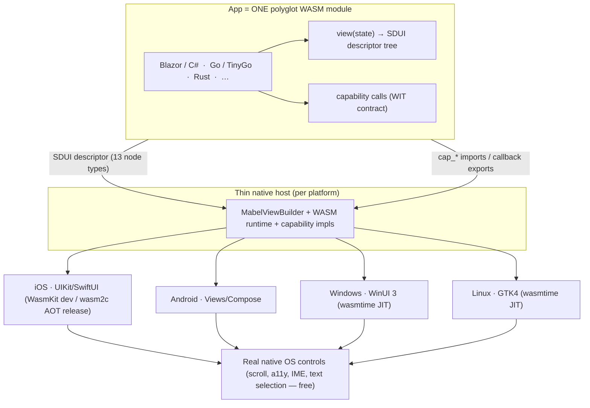

# Mabel Framework

> [Leia em Português / Read in Portuguese](README.pt-BR.md)

**Mabel** builds cross-platform apps — **mobile and desktop** — from **one polyglot
WASM module**. You write your app once (in C#/Blazor, Go, Rust, or any language that
compiles to WebAssembly); a **thin native host** per platform turns a **semantic UI
descriptor** into **real native OS controls**. **No WebView. No canvas re-implementation
of the OS. And no Mac required to ship to iPhone.**

---

## The thesis: WASM as the "universal DLL"

A DLL is a compiled artifact any program can load and call through a stable ABI,
regardless of the language it was written in. Mabel applies that idea to **whole apps**:

> **Your app is one `.wasm` module.** It is language-agnostic (polyglot), sandboxed,
> and portable. Each platform ships a small host that loads that one module and speaks
> two contracts with it: a **UI descriptor** (what to show) and a **capabilities ABI**
> (what the device can do). The host renders the descriptor with the platform's own
> native controls.

Everything else in Mabel follows from this one idea.



---

## How it works, end to end

1. **You author UI** in a high-level language. On the .NET path that's **Blazor/Razor**
   (`.razor`) driven by a custom renderer that emits a descriptor instead of HTML.
2. **It compiles to one WASM module** — sandboxed, portable, no browser runtime.
3. **The guest emits an SDUI descriptor** — a *semantic tree of controls* ("a scrollable
   list of cards, each with a title and a progress bar"), **not** a pixel display-list.
4. **A thin native host loads the module** and walks the descriptor with a
   `MabelViewBuilder`, instantiating **real native controls** of that OS.
5. **Interaction flows back semantically:** a tapped control returns `{action, id, data}`
   — never pixel coordinates. Scroll, focus, accessibility, text selection, IME and
   dynamic type come **for free** because they are genuine OS controls.
6. **The app reaches the device** via capabilities: a WIT-defined ABI mediates camera,
   GPS, notifications, biometrics, secure storage, share, clipboard, haptics.

### SDUI: semantic descriptor → native controls (not canvas, not WebView)

Other frameworks either re-implement the entire UI stack on a canvas (Flutter) or
wrap a WebView (Ionic, Tauri). Mabel does neither: it sends a **semantic description**
and lets each OS render it natively. The descriptor is a versioned tree
(`Mabel.Wasi.Protocol/Sdui/Descriptor.cs`) with 13 node types (v1):

`Screen · VStack · HStack · ScrollView · List · Card · Text · Button · Image · Badge ·
ProgressBar · Divider · Spacer`

Each node has a **stable semantic `Id`** (e.g. `card:50231`), flex-like layout props,
box/text styling, and an optional `OnTap` action. See **[ADR 0001](docs/adr/0001-sdui-descriptor.md)**.

### No Mac, ever — iOS via xtool

Shipping to iPhone normally requires a Mac (Xcode). Mabel's hard constraint is **no
Mac**, which is why it rejects MAUI, Flutter, Compose Multiplatform, and BlazorBindings.Maui
for the iOS target — all need Mac/Xcode. Instead the iOS host is **hand-rolled Swift
(UIKit/SwiftUI)**, built and signed from Linux/WSL with **[xtool](https://github.com/xtool-org/xtool)**.
A hello-world IPA has already been built and deployed this way.

### Dev vs Release: two runtimes, one module

iOS forbids JIT, which shapes the runtime story:

| | Runtime | JIT? | Hot reload? | Speed | Why |
|---|---|---|---|---|---|
| **Dev (iOS)** | **WasmKit** (interpreter, Swift) | No | **Yes** | interpreted | Interpreter can load/swap modules at runtime → enables HMR on-device |
| **Release (iOS)** | **wasm2c → C → arm64** via xtool's toolchain | AOT | No | ~native | No Mac, no JIT, near-native speed. HMR is a dev-only feature |
| **Dev/Release (desktop)** | **wasmtime** (Cranelift JIT) | Yes | **Yes** | full | Desktop has no JIT ban → the fastest inner loop |

The **same** `.wasm`, descriptor and WIT feed all of these. (WASM-on-device — WasmKit
+ xtool + .NET→wasm without a Mac — is being validated by a spike.)

### Targets

- **Mobile:** **iOS** (UIKit/SwiftUI host, via xtool) and **Android** (Views/Compose host).
- **Desktop:** **Windows** (WinUI 3) and **Linux** (GTK4). Desktop is the **primary HMR
  loop** (JIT, no device). See **[docs/desktop.md](docs/desktop.md)** / **[ADR 0004](docs/adr/0004-desktop.md)**.
- **Deferred:** **macOS-desktop** (same no-Mac constraint — enters later as just another host).

### Polyglot guests

Because the contract is WASM + a descriptor + a WIT ABI — not a language SDK — the app
can be written in **any language that targets WASM/WASI**: C#/Blazor (primary),
Go/TinyGo, Rust, and more. The host neither knows nor cares which one produced the module.

### Capabilities: what the app can do on the device

The guest is sandboxed (no direct OS access). Native device APIs are reached through a
**capability-based ABI**, modeled in **WIT** (`Mabel.Wasi.Protocol/Capabilities/wit/`,
`package mabel:capabilities`) as the north-star, with the **real wire being a flattened
WASI-Preview-1 core-module** today (same pattern as the render channel). Key design
points (**[ADR 0002](docs/adr/0002-capabilities-abi.md)**, **[docs/capabilities-abi.md](docs/capabilities-abi.md)**):

- **Async via request-id + single callback** (not Component Model futures, which are
  immature on this stack): the guest passes a `reqId`, gets an immediate status, and the
  host later calls one export `mabel_on_capability_result(reqId, …)`. The guest resolves
  a `TaskCompletionSource` → idiomatic `await`.
- **Security in two layers:** a **manifest** (host grants only declared capabilities —
  least authority by construction) plus the **OS consent prompt** at runtime.
- **Free Apple account** cuts push notifications and iCloud/shared keychain (no paid App
  ID); notifications are **local-only**, secure storage is **per-app**.

### Authoring layer: Blazor without MAUI

On the .NET path you write **Blazor/Razor** components. A **custom renderer** turns the
component tree into an SDUI descriptor (referencing **BlazorBindings** as a design
reference — **not** MAUI, which needs a Mac). Blazor is the ergonomic front-end; the
descriptor is the portable output.

### Hot Module Reload + state preservation

`mabel dev` watches files, recompiles the WASM, and signals the host over WebSocket; the
host then **hot-swaps** the module and re-renders. The hard part is **state** — a swapped
module gets fresh linear memory, so in-guest state is lost unless transported. Mabel's
layered answer (**[docs/hmr-e-estado.md](docs/hmr-e-estado.md)** / **[ADR 0003](docs/adr/0003-hmr-e-estado.md)**):

- **Default architecture — externalized state store (Elm/TEA):** app is `view(state)` +
  `update(state, action)`; state lives in a **host store**, so it survives the swap by
  construction. The only option that composes with hot-swap **and** polyglot guests, and
  it already matches SDUI (the descriptor is a pure function of state).
- **Transport — snapshot** (`serialize_state`/`restore_state`) moves the opaque state
  blob across a swap.
- **.NET optimization — Roslyn Hot Reload** applies IL deltas in-place for method-body
  edits (no swap, 100% preserved).
- **Fallback — full reload** when the state shape changed incompatibly.

Honest about what survives: **pure data** (screen/navigation/form/scroll/loaded models)
survives; **live OS bindings** (camera sessions, GPS streams, sockets, timers, in-flight
capability calls) do **not** — the host tears them down and the new module re-subscribes.

---

## How Mabel compares

| Framework | UI rendering | App language | iOS build without a Mac? |
|---|---|---|---|
| **Mabel** | **Native OS controls** (SDUI) | **Any → WASM** (polyglot) | **Yes (xtool)** |
| Flutter | Own engine (Skia canvas) | Dart | No (needs Mac/Xcode) |
| React Native | Native controls | JavaScript | No |
| .NET MAUI | Native controls | C# only | No |
| Uno Platform | WinUI XAML everywhere | C# only | No |
| Compose Multiplatform | Own (Skia), native on Android | Kotlin only | No |
| Kotlin Multiplatform | Per-platform native (UI not shared) | Kotlin only | No |
| Tauri | WebView (HTML/CSS/JS) | Rust + web front-end | No |

Mabel's differentiator is the **intersection**: *one polyglot WASM module* → *real
native OS controls* → *built without a Mac*. No other framework in the table sits at all
three points at once.

Trade-off, stated honestly: SDUI's expressive power is bounded by its node set. Bespoke
visuals (custom-drawn charts, game-like UI) would need a schema extension or a `Canvas`
escape node — out of scope for v1. If your product is mostly custom pixels, a canvas
framework may fit better; Mabel targets control-based app UI (forms, lists, boards,
dashboards).

---

## Current status — proven vs. in design

Mabel is early. This section is deliberately honest.

**Proven / working:**
- CLI (`mabel`, .NET 10 AOT), dev server with file-watch + WebSocket reload, renderer
  with a green test suite.
- iOS IPA **built and deployed from Linux without a Mac** via xtool (hello-world).
- Original pixel display-list render on iOS (Core Graphics) — the spike that motivated
  the pivot to SDUI (a canvas has no scroll/a11y/IME for free). Kept for reference,
  **superseded** by SDUI.

**In design (this consolidation + sibling branches):**
- **SDUI descriptor → native UIKit** (ADR 0001): schema committed; iOS view-builder
  drafted on `feat/sdui-descriptor`; not yet proven on device.
- **Capabilities ABI** (ADR 0002): WIT + contracts + manifest model; design only.
- **HMR + state** (ADR 0003) and **Desktop host** (ADR 0004): design in this branch.

**Being validated (spike):**
- **WASM-on-device**: WasmKit interpreter + xtool + .NET→wasm on a physical iPhone,
  no Mac. This spike gates the dev runtime, HMR-on-iOS, and the release wasm2c path.

**ADR index:** [0001 SDUI](docs/adr/0001-sdui-descriptor.md) ·
[0002 Capabilities ABI](docs/adr/0002-capabilities-abi.md) ·
[0003 HMR + state](docs/adr/0003-hmr-e-estado.md) ·
[0004 Desktop](docs/adr/0004-desktop.md)

> Note: ADRs 0001 and 0002 currently live on their own feature branches
> (`feat/sdui-descriptor`, `feat/mabel-capabilities-abi`); 0003/0004 and this README are
> on `feat/mabel-arch-consolidation`. The links resolve once the branches are integrated.

---

## Project structure

```
mabel-framework/
  Mabel.sln
  src/
    Mabel.Wasi.Protocol/       # Contracts guest<->host
      Protocol.cs              #   legacy pixel display-list (reference; superseded by SDUI)
      WasiContract.cs          #   render function names
      Sdui/Descriptor.cs       #   SDUI semantic tree (13 node types)  [ADR 0001]
      Capabilities/            #   WIT + flattened core-module ABI     [ADR 0002]
        wit/                   #     mabel:capabilities (camera, location, ...)
        CapabilityContract.cs  #     flattened p1 wire
        CapabilityManifest.cs  #     capability manifest model
    Mabel.Renderer/            # ICanvas + MabelRenderer (legacy display-list path)
    Mabel.Core/                # Features, Ports, Infrastructure (vertical slice + hexagonal)
      Features/DevServer/      #   HTTP + WebSocket hot-reload server
    Mabel.Cli/                 # `mabel` CLI (AOT)
    Mabel.Host.Ios/            # Swift host (UIKit view-builder + WASM runtime)
  docs/
    adr/0001..0004             # architecture decision records
    sdui-*, capabilities-abi.md, hmr-e-estado.md, desktop.md
  samples/                     # hello-world, hello-world-ios
  tests/                       # Mabel.Core.Tests, Mabel.Renderer.Tests
```

Architecture: **vertical slice** (each feature self-contained under `Features/`) +
**hexagonal/ports-adapters** (all I/O behind `IShellExecutor`/`IFileSystem`; real
adapters in `Infrastructure/`, fakes in tests). Only two .NET app projects: `Mabel.Core`
and the thin `Mabel.Cli`.

## CLI

```bash
mabel doctor            # Check environment (tools, PATH, WSL detection)
mabel setup             # Install deps (.NET 10, Swift, xtool, wasmtime, WasmKit)
mabel create <name>     # Scaffold a new Mabel project
mabel deploy [path]     # Build and run on a device/emulator
mabel dev [path]        # Dev server with hot reload (Expo-style)
mabel devices           # List connected devices
mabel usb-help          # USB setup guide for physical devices
mabel version
```

Options: `--platform/-p` (`ios`|`android`|`desktop`|`all`), `--bundle-id/-b`,
`--port/-P` (default 5555), `--verbose`.

## Getting started

```bash
git clone https://github.com/dmarquezbh/mabel-framework.git
cd mabel-framework
chmod +x setup.sh && ./setup.sh          # .NET 10, Swift, xtool, wasm runtimes, USB tooling
export PATH="$HOME/.dotnet:$PATH"
dotnet run --project src/Mabel.Cli -- doctor
dotnet build && dotnet test
```

Developed and tested on **Linux / WSL2** (Ubuntu). For iOS-from-Linux over USB, see
`mabel usb-help`.

## Technology stack

- **.NET 10** — CLI (AOT), Blazor authoring, renderer, protocol
- **WASM/WASI** — the app module; **WasmKit** (iOS dev interp.), **wasm2c→arm64** (iOS
  release AOT), **wasmtime** (desktop JIT)
- **WIT** — capability contracts (`package mabel:capabilities`)
- **Swift** (UIKit/SwiftUI) — iOS host · **WinUI 3 / GTK4** — desktop hosts
- **xtool** — iOS build & deploy from Linux (no Mac)
- **xunit v3** — tests

## Contributing

Contributions welcome — open an issue or PR. Architecture decisions are recorded as ADRs
under `docs/adr/`; please read the relevant ADR before proposing changes to a subsystem.

## License

MIT
