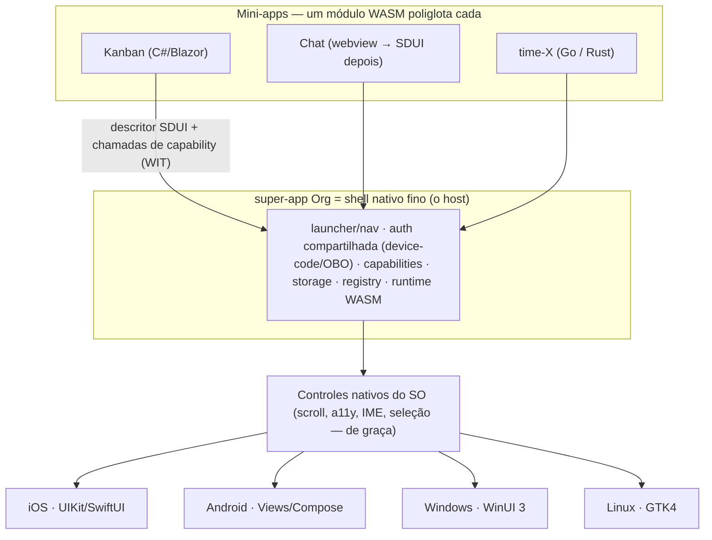

# Mabel Framework

> [Read in English](README.md)

**O Mabel é uma plataforma de super-app poliglota.** Um app é publicado no device; as
funcionalidades são **mini-apps WASM** — um por projeto/time — que uma **casca (shell)
nativa fina** renderiza como **controles nativos de verdade do SO**. Cada time escreve na
sua própria linguagem; todos os mini-apps falam o mesmo contrato semântico de UI. **Sem
WebView. Sem reimplementar o SO num canvas. E sem Mac pra publicar no iPhone.**

---

## O panorama: a plataforma de super-app da Org

> **Cada projeto/time da Org entrega o seu mini-app; o super-app Org renderiza todos.**

Há **um único app Org** no device. As features não são telas hard-coded — são **mini-apps**
independentes (cada um = um módulo WASM + um descritor de UI), de times diferentes, que o
shell carrega e renderiza. Adicionar ou corrigir uma feature = publicar um mini-app novo,
**sem reinstalar** o app (ver [OTA](docs/ota.md)).

**Pilares:**

- **Um app, muitas features.** Org é o app; Kanban, Chat e o que cada time construir são
  mini-apps dentro dele. Crescem sem passar de novo pela loja.
- **Poliglota por time.** Cada time no seu stack — Ledger em .NET/Blazor, outro em Go/Rust —
  e **todos emitem o mesmo descritor SDUI**. A plataforma democratiza; não obriga ninguém a
  adotar .NET (ver [autoria poliglota](docs/autoria-poliglota.md)).
- **Compartilhado pelo super-app.** Identidade/auth (device-code/OBO — login **uma vez**,
  todos os mini-apps herdam), capabilities (câmera/GPS/notif via WIT), storage, e o
  launcher/navegação entre mini-apps.
- **Sandbox por mini-app.** Cada mini-app roda isolado no seu próprio sandbox WASM — um
  projeto não lê a memória nem quebra o outro; autoridade só pelo que o manifesto concede.
  O modelo de segurança certo pra código de muitos times num app.
- **Registry de mini-apps.** O shell lista e carrega os mini-apps publicados — baked no
  build (compatível com loja) ou dinâmico interno (enterprise/MDM).

Design completo: **[docs/super-app.md](docs/super-app.md)** · **[ADR 0005](docs/adr/0005-super-app.md)**.

---

## O mecanismo: WASM como "DLL universal"

Uma DLL é um artefato compilado que qualquer programa carrega e chama por uma ABI estável,
seja qual for a linguagem que a escreveu. O Mabel aplica isso a **apps inteiros**:

> **Um mini-app é um único `.wasm`.** Agnóstico de linguagem (poliglota), sandboxed,
> portátil. O shell o carrega e fala dois contratos com ele: um **descritor de UI** (o que
> mostrar) e uma **ABI de capabilities** (o que o device pode fazer). O shell renderiza o
> descritor com os controles nativos da própria plataforma.



---

## Como funciona, de ponta a ponta

1. **Você escreve a UI** numa linguagem de alto nível. No caminho .NET, é **Blazor/Razor**
   (`.razor`) com um renderer custom que emite um descritor em vez de HTML.
2. **Compila pra um módulo WASM** — sandboxed, portátil, sem runtime de browser.
3. **O mini-app emite um descritor SDUI** — uma *árvore semântica de controles* ("uma lista
   rolável de cards, cada um com título e barra de progresso"), **não** um display-list de
   pixels.
4. **O shell carrega o módulo** e percorre o descritor com um `MabelViewBuilder`,
   instanciando **controles nativos de verdade** daquele SO.
5. **A interação volta semântica:** um controle tocado devolve `{action, id, data}` — nunca
   coordenadas de pixel. Scroll, foco, acessibilidade, seleção de texto, IME e Dynamic Type
   vêm **de graça**, porque são controles nativos de verdade.
6. **O mini-app alcança o device** via capabilities: uma ABI descrita em WIT media câmera,
   GPS, notificações, biometria, secure-storage, share, clipboard, haptics.

### SDUI: descritor semântico → controles nativos (não canvas, não WebView)

Outros frameworks ou reimplementam a stack de UI inteira num canvas (Flutter) ou embrulham
um WebView (Ionic, Tauri). O Mabel não faz nenhum dos dois: manda uma **descrição
semântica** e deixa cada SO renderizar nativamente. O descritor é uma árvore versionada
(`Mabel.Wasi.Protocol/Sdui/Descriptor.cs`) com 13 tipos de nó (v1):

`Screen · VStack · HStack · ScrollView · List · Card · Text · Button · Image · Badge ·
ProgressBar · Divider · Spacer`

Cada nó tem um **`Id` semântico e estável** (ex.: `card:50231`), props de layout flex-like,
estilo de caixa/texto e um `OnTap` opcional. Ver **[ADR 0001](docs/adr/0001-sdui-descriptor.md)**.

### Sem Mac, nunca — iOS via xtool

Publicar no iPhone normalmente exige um Mac (Xcode). A trave dura do Mabel é **sem Mac — por
princípio, zero toolchain Apple** (não é só "não comprar Mac"). Isso descarta MAUI, Flutter,
Compose Multiplatform, Uno e BlazorBindings.Maui pro iOS — todos exigem Mac/Xcode. Em vez
disso, o host iOS é **Swift hand-rolled (UIKit/SwiftUI)**, buildado e assinado a partir do
Linux/WSL com **[xtool](https://github.com/xtool-org/xtool)**. Um IPA hello-world já foi
buildado e instalado assim.

### Runtimes: o que roda de fato no device

O iOS proíbe JIT. Um spike (task #17, v2) checou o que de fato roda onde. Um app pode carregar
**os dois** runtimes iOS ao mesmo tempo (ver abaixo), mas só um dos dois tem spike por trás
até agora:

| | Runtime | JIT? | HMR? | Linguagem do guest no device | Status |
|---|---|---|---|---|---|
| **iOS (dev & live)** | **WasmKit** (interpretador puro-Swift) | Não | Sim | **só lean core-wasm** (Rust/TinyGo/AssemblyScript/C) | **CONFIRMADO no iOS Simulator** (`experiments/wasmkit-ios/`): load ~1,66ms, hot-swap ~0,10-0,14ms, 0 crashes em 5 ciclos. Validação em device físico ficou bloqueada por limite de conta Apple Developer, não é bloqueio de engenharia. |
| **iOS (release, rápido)** | **wasm2c → C → clang do xtool → arm64** (AOT) | AOT | Não | lean core-wasm | **não coberto por este spike** — uma alegação anterior "~163× vs interpretador, provado no device" não foi corroborada por nenhum spike encontrado neste repo; tratar como não verificada até um spike de AOT dedicado rodar |
| **Desktop** | wasmtime (Cranelift JIT) | Sim | Sim | amplo, **incl. .NET/Blazor** | desenhado |
| **Android** | wasmtime-JNI / Chicory (JIT) | Sim | Sim | amplo | desenhado |

**Correção:** uma versão anterior desta seção alegava que os dois runtimes rodaram lado a lado
no mesmo app, num iPhone físico, com o caminho AOT **~163×** mais rápido que o interpretador.
Só a linha do interpretador WasmKit acima tem um spike de verdade neste repo
(`experiments/wasmkit-ios/`), e ele rodou no **iOS Simulator** — não num device físico
(bloqueado por limite de conta Apple Developer, não por limitação de engenharia). Não existe
spike de AOT neste repo; tratar o número ~163× como não verificado até um spike dedicado rodar.

> **Achado importante e honesto (spike):** **`.NET → wasm` não roda no WasmKit.** O .NET
> emite um Component WASI-Preview-2 + Mono (~3,34 MB); o WasmKit é um runtime core-module +
> Preview-1 → mismatch de formato, rejeitado (flags de tamanho maxadas não ajudam — o peso é
> o runtime Mono, e o `wasm-opt` rejeita o component). Um core module Rust, por outro lado, é
> ~55 B e roda. Então o **guest live-on-iOS é um lean core-wasm** (Rust/TinyGo/AssemblyScript/
> C), não .NET. **`NativeAOT-LLVM` é o caminho certo de .NET-no-device mas está bloqueado no
> WSL hoje** (SDK experimental + ~1 GB de emsdk) → fase própria. **O papel do .NET/C#/Blazor é
> autoria, geração de descritor em build-time** (ex.: o `board_gen` roda no build/WSL e emite
> JSON de descritor — é assim que a tela iOS provada hoje funciona; o renderer Blazor roda
> headless/sem-browser, precedente HtmlRenderer/BlazorBindings) **e desktop/Android** (runtimes
> JIT que rodam .NET-wasm). A promessa poliglota é real, com esse asterisco por plataforma.

### Alvos — quatro famílias de host

- **Mobile:** **iOS** (host UIKit/SwiftUI, via xtool) e **Android** (host Views/Compose).
- **Desktop:** **Windows** (WinUI 3) e **Linux** (GTK4). Desktop é o **loop primário de HMR**
  (JIT, sem device). Ver **[docs/desktop.md](docs/desktop.md)** / **[ADR 0004](docs/adr/0004-desktop.md)**.
- **Web:** um **host web renderiza o MESMO descritor em DOM / web-components** — alvo de 1ª
  classe de verdade, não só preview. Roda o guest no runtime WASM nativo do browser;
  capabilities só-device (câmera/GPS) são **mockadas** no host web pro dev.
- **A confirmar:** **macOS-desktop** — build sem-Mac é plausível, mas não é caminho pavimentado
  do xtool ainda; precisa de spike (task #21).

Mesmo descritor em tudo, **renderizado por plataforma** — nativo parece nativo, web parece
web. **Não** é pixel-idêntico entre alvos, by design: é o ponto do SDUI (mesma tela, estrutura
e comportamento; a cara de cada plataforma).

---

## Arquitetura de super-app

O shell é um **host multi-módulo**: carrega e gerencia o ciclo de vida de **vários**
mini-apps (carregar sob demanda, descarregar, hot-swap), cada um emitindo seu descritor
SDUI, todos renderizados pelos mesmos controles nativos. Provê **serviços compartilhados** —
identidade/auth, capabilities, storage (compartilhado + por-mini-app), navegação, e
mensageria entre mini-apps mediada pelo shell (eles nunca se enxergam direto; o sandbox
segura).

**Isolamento é garantia por design:** publicar ou atualizar um mini-app (ex.: Ledger) **não
quebra outro** (ex.: Chat) — sandbox WASM separado + memória linear isolada + descritor
próprio + error boundary + versão independente no registry. É propriedade da arquitetura,
**desenhada, ainda não implementada** (depende do host multi-módulo + WASM-live).

**Incorporando o Chat:** o caminho rápido é um **mini-app webview** (o Chat já é web →
hospedado numa `WKWebView`/`WebView2` ao lado dos mini-apps SDUI-nativos, reusando a web de
hoje com a auth/capabilities do shell), migrando pra SDUI-nativo depois. Um super-app
**misto** (uns mini-apps SDUI-nativos, outros webview) é suportado. O webview aqui é uma
casca por-mini-app opcional, **não** a arquitetura do app — a tese "sem WebView" vale pro
Mabel-nativo.

Design completo: **[docs/super-app.md](docs/super-app.md)** · **[ADR 0005](docs/adr/0005-super-app.md)**.

---

## Atualização em runtime / OTA

Como o shell é estável e os mini-apps são conteúdo, features podem ir **over-the-air**. Três
níveis (design completo: **[docs/ota.md](docs/ota.md)** · **[ADR 0006](docs/adr/0006-ota.md)**):

| Nível | O que muda | Lógica nova? | OTA interno | App Store pública |
|---|---|---|---|---|
| **1. Descritor-only** | UI/conteúdo (a árvore SDUI, textos, layout, dados) | Não — dado puro | ✅ sempre seguro | ✅ ok (é dado, não código) |
| **2. Mini-app WASM (lógica)** | um `.wasm` novo/atualizado, rodado pelo **interpretador** | Sim | ✅ livre | ⚠️ cinza (ver abaixo) |
| **3. Shell nativo** | o host/app em si | Sim (nativo) | ❌ só loja | ❌ só loja |

**Os dois runtimes coexistem num app (esse é o pulo do gato):** um app leva um **core AOT
baked** (wasm2c→nativo — rápido, offline, store-clean) **E** o **interpretador WasmKit** pros
mini-apps/lógica OTA'd — **não** é um OU outro. Assim mantém WASM rápido (baked) *e* tem OTA
(descritor sempre + lógica-wasm interpretada). Os dois caminhos foram provados lado a lado no
device.

**A tensão AOT-vs-OTA (física honesta):** pra *um mesmo* pedaço de código, "velocidade nativa
+ OTA de lógica *nova* + App Store pública" não coexistem — rápido = baked = sem OTA; OTA =
interpretado = cinza-público. **Interno Org não tem esse limite.** E o **descritor-OTA**
(instantâneo, sempre store-safe) cobre o grosso da mudança de qualquer forma. Estratégia:
**core AOT baked** (rápido/loja) + **interpretador pros mini-apps OTA'd** (interno) +
**descritor-OTA sempre** (mais rápido, mais seguro, qualquer canal).

**Policy, honesto:** Org **enterprise/interno/MDM** = OTA livre (não passa por App Review).
A **App Store pública** (guideline **2.5.2**) restringe baixar código executável; **JS tem
carve-out** explícito (JSCore — por isso RN/CodePush/WeChat podem), **WASM rodado pelo teu
próprio interpretador não → zona cinza.** Saídas públicas seguras: descritor-OTA + mini-app
webview + mini-apps AOT-baked.

---

## Store-safety: a linha DADO vs CÓDIGO (dois tiers)

A regra da Apple é simples — **dado é livre, código baixado não.** Isso reduz os níveis
acima a dois tiers de store-safety:

- **Tier 1 — SDUI puro (store-safe *e* instantâneo):** host nativo + uma **biblioteca de
  componentes/ações BAKED** + um **descritor server-driven (DADO)**. O servidor manda o
  descritor; o app renderiza controles nativos e roda **ações NOMEADAS que já conhece**
  (baked). Zero código baixado → zero 2.5.2. Telas/layout/conteúdo novos = **OTA instantâneo,
  ilimitado, sem review** (modelo SDUI do Airbnb/Spotify). Pode **nem precisar de WASM no
  device**.
- **Tier 2 — lógica portátil / comportamento (WASM):** só pra comportamento genuinamente
  novo além do vocabulário baked. **AOT-baked (wasm2c→nativo) = 100% store-clean** (revisado
  como binário nativo), sem OTA; ou **interpretado (WasmKit) = OTA**, cinza público / ok
  interno.

**Estratégia:** investir num vocabulário rico de ações/componentes baked → a maioria dos
updates vira só descritor novo (dado) — instantâneo e store-clean pra sempre; WASM-live fica
reservado ao comportamento novo. Ver **[docs/ota.md §5](docs/ota.md)**.

## Modelo offline

- **WASM é o motor do offline.** Com WASM local, a lógica roda no device: gera o descritor a
  partir do estado local, trata evento e computa **offline**. Sem WASM (só server-driven),
  offline = **cache read-only** (descritor + dados cacheados + ações baked nativas) — lógica
  custom offline não tem onde rodar.
- **Híbrido (recomendado):** online = SDUI do servidor (fresco/instantâneo/OTA); cacheia
  descritor + dados **+ o módulo WASM**; offline = roda o WASM cacheado → app funcional de
  verdade; sincroniza ao voltar.
- **Mais simples:** **WASM AOT-baked = offline por construção** (está no binário) +
  descritores do servidor pra frescor online por cima = melhor dos dois.
- **Regra:** app fino (só exibe dado do servidor) → dá pra dispensar WASM (cache + nativo,
  offline read-only). App offline-de-verdade/interativo → mantém WASM como motor local (baked
  recomendado). Ver **[docs/ota.md §6](docs/ota.md)**.

---

## Autoria poliglota

**O contrato é o descritor SDUI + o WIT — não o Blazor.** Blazor é só o jeito idiomático do
C# de produzir o descritor. Três camadas (design completo:
**[docs/autoria-poliglota.md](docs/autoria-poliglota.md)** · **[ADR 0007](docs/adr/0007-autoria-poliglota.md)**):

1. **Fonte única = WIT/schema** (descritor + capabilities, `package mabel:*`).
2. **Codegen (wit-bindgen) gera tipos + bindings de capability por linguagem** (C#, Go,
   Rust) — o grosso de "falar o protocolo" é gerado, não escrito à mão.
3. **Açúcar de autoria idiomático por linguagem:**
   - **C# (flagship):** Blazor/Razor + renderer custom → descritor (referência = fork do
     **BlazorBindings**, retarget do backend MAUI→SDUI — **não** o MAUI).
   - **Go:** builders idiomáticos (`VStack(Card(...))`) ou lib estilo templ/gomponents;
     TinyGo→wasm.
   - **Rust:** macros/RSX, ou adaptar Dioxus/Leptos (já produzem árvore virtual); Rust→wasm.

Um **SDK-guest fino por linguagem** (tipos gerados + loop de render + açúcar) sobre um **core
compartilhado** (host/renderer/capabilities/shell). Prioridade: **C#/Blazor primeiro** (time
Ledger, melhor DX); Go/Rust habilitados publicando o WIT + o gerador. A arquitetura
**permite** os três; não **obriga** os três no dia 1. (Ressalva on-device: o guest live-iOS
é lean-lang, não .NET — ver a tabela de runtimes acima.)

---

## Capabilities

Mini-apps são sandboxed (zero acesso direto ao SO). APIs nativas são alcançadas por uma **ABI
capability-based**, modelada em **WIT** (`Mabel.Wasi.Protocol/Capabilities/wit/`,
`package mabel:capabilities`) como north-star, com o **wire real sendo um core-module WASI
Preview 1 achatado** hoje. Pontos-chave (**[ADR 0002](docs/adr/0002-capabilities-abi.md)**,
**[docs/capabilities-abi.md](docs/capabilities-abi.md)**):

- **Async por request-id + callback único** (não futures do Component Model — imaturos neste
  stack): o guest passa um `reqId`, recebe status na hora, e o host depois chama um export
  `mabel_on_capability_result(reqId, …)` → o guest resolve um `TaskCompletionSource` pra
  `await` idiomático.
- **Segurança em duas camadas:** um **manifesto** (o host só provê capabilities declaradas —
  least authority por construção) mais o **prompt de consentimento do SO** em runtime.
- **Conta Apple free** corta push e iCloud/keychain compartilhado; notificações são só locais,
  secure-storage é só por-app.

---

## Hot Module Reload + preservação de estado

O `mabel dev` observa arquivos, recompila o WASM e sinaliza o host por WebSocket; o host então
faz **hot-swap** do módulo e re-renderiza. Um módulo trocado ganha memória linear nova, então
o estado dentro do guest se perde a menos que seja transportado. A resposta em camadas
(**[docs/hmr-e-estado.md](docs/hmr-e-estado.md)** · **[ADR 0003](docs/adr/0003-hmr-e-estado.md)**):

- **Padrão — store de estado externalizado (Elm/TEA):** o app é `view(estado)` +
  `update(estado, ação)`; o estado vive num **store do host** e sobrevive ao swap por
  construção. A única opção que compõe com hot-swap **e** guests poliglotas, e já casa com o
  SDUI.
- **Transporte — snapshot** (`serialize_state`/`restore_state`) move o blob de estado opaco
  através do swap.
- **Otimização .NET — Roslyn Hot Reload** aplica deltas de IL in-place pra edições de corpo de
  método (sem swap, 100% preservado) — **só desktop/Android** (não iOS: o WasmKit não roda
  .NET-wasm).
- **Fallback — reload total** quando o shape do estado mudou incompatível.

Honesto sobre o que sobrevive: **dado puro** (tela/navegação/form/scroll/dados carregados)
sobrevive; **ligações vivas com o SO** (sessões de câmera, streams de GPS, sockets, timers,
chamadas de capability em voo) **não** — o host as encerra e o módulo novo re-subscreve.

**HMR multi-alvo simultâneo (a DX matadora):** o dev-server faz broadcast de cada rebuild por
WebSocket pra **todos os hosts conectados ao mesmo tempo** — browser + app no device + desktop
re-renderizam juntos na mesma edição, com o store externalizado sobrevivendo ao diff. Uma
edição, ao vivo em todos os alvos — o loop Flutter-multi-device, mas via descritor compartilhado.

---

## Desktop, e a decisão de toolkit

Desktop é alvo de 1ª classe e o loop primário de HMR (runtime JIT, sem device). **Não existe
um toolkit único cross-desktop de controles nativos do SO**, então a escolha é explícita:

- **Nativo por-OS** (Windows = WinUI 3/Win32, Linux = GTK4/Qt, macOS = AppKit): controles
  100% nativos, honrando a tese — mas um view-builder por OS.
- **Toolkit cross-desktop de render próprio** (Avalonia/Qt): um host só, mas desenha os
  próprios controles (Skia-like) — não os controles do SO, o que rompe o princípio "controles
  nativos" (mesma razão pela qual o canvas foi rejeitado no mobile).

**Decisão (ADR 0004):** mirar **nativo por-OS onde importa — Windows e Linux primeiro (sem
Mac); macOS a confirmar (spike de build sem-Mac).** Avalonia é permitido como **preview/andaime**
de host único no bring-up, não como destino. Runtime: **wasmtime** (Cranelift JIT). Ver
**[docs/desktop.md](docs/desktop.md)**.

### Distribuição + auto-update (diferencial de verdade)

Split em duas camadas:

- **Conteúdo (WASM + descritores): OTA do servidor → shell recarrega** — instantâneo, minúsculo,
  sem reinstalar, sem restart (hot-swap). **No desktop isso é 100% livre:** não há loja
  obrigatória no Windows/Linux/macOS-direto, então o cinza 2.5.2 do iOS **não existe** — OTA de
  descritores *e* lógica-wasm é irrestrito.
- **Shell nativo (raro): o updater padrão da plataforma** — Windows: MSIX / Squirrel.Windows;
  Linux: **AppImage + AppImageUpdate (delta/zsync)** / Flatpak / Snap / apt; macOS: **Sparkle**
  (⚠️ precisa notarização — amarra no spike macOS via API `notarytool`).

**Vs. os concorrentes:** Electron/Tauri **re-baixam o binário inteiro** a cada update
(electron-updater / Tauri updater); **o Mabel re-baixa só o conteúdo** (KB, instantâneo, sem
fechar). Separar um shell que muda pouco de um conteúdo que muda muito é o ganho.

**Robustez:** canais stable/beta/canary + rollout gradual + rollback (guarda a versão anterior)
+ **updates assinados** (verifica a assinatura do wasm/shell antes de aplicar — senão vira vetor
de ataque; exige gerência de chave).

**Honesto:** o updater de shell por-OS é trabalho real e padrão; macOS-shell-update = Sparkle +
notarização (ferramentas Apple, alcançáveis via API sem Mac — pendente do spike).

---

## Debugging & DevTools

Debug é **multi-camada**, uma ferramenta por fronteira (design completo:
**[docs/debugging.md](docs/debugging.md)** · **[ADR 0008](docs/adr/0008-debugging.md)**):

1. **Lógica (guest WASM)** — debuga no **desktop/build-host** (runtime full, debugger normal);
   a lógica é a mesma que roda no device.
2. **Descritor (árvore SDUI)** — um **inspector de descritor** (árvore, props ao vivo, diff de
   frame, time-travel) — estilo React-DevTools/Flutter-inspector; trivial porque descritor é
   dado puro.
3. **Render nativo** — **select-mode**: toca numa view nativa → o nó SDUI de origem (`Id`).
4. **Wire guest↔host** — um **wire inspector** ("aba Network" do protocolo: descritores,
   eventos de tap, chamadas de capability com `reqId`/streams traçados).

**Alavanca Mabel-específica:** o **host web + DevTools do browser é a superfície primária de
debug** (o mesmo descritor roda no web e no nativo via HMR multi-alvo → debuga no Chrome
DevTools, fiel ao nativo, reusando tooling maduro); **replay determinístico** (app = descritor
+ WASM + estado externalizado → captura e re-executa → reproduz o bug a partir do dado);
**error boundaries** (erro de nó/guest isola no mini-app/subárvore — não derruba o super-app —
com overlay de erro no dev).

**Status honesto:** hoje o debug é **`NSLog` via `idevicesyslog`** (foi como o tap no device
foi validado) — primitivo. O toolset maduro (inspector/wire/replay/boundaries) é 🟢-tier,
**onda 4** do roadmap (task #20).

---

## Status — honesto, por plataforma

Legenda: **PROVADO** (roda, validado) · **DESENHADO** (spec/ADR, não construído) · **A-FAZER**
(não começado) · **A-CONFIRMAR** (plausível, precisa spike) · **BLOQUEADO** (trava externa).

O **contrato do descritor SDUI** e o **WIT de capabilities** são platform-neutral e
compartilhados: contrato **DESENHADO (v1 commitado)**. Peças por plataforma:

| Camada | iOS | Android | Windows | Linux | macOS | Web |
|---|---|---|---|---|---|---|
| Host renderiza descritor → controles nativos | **PROVADO**¹ | DESENHADO | DESENHADO | DESENHADO | A-CONFIRMAR² | DESENHADO (→DOM) |
| Runtime WASM (guest live no device) | **PROVADO** (só interp. WasmKit)³ | DESENHADO (JIT) | DESENHADO (wasmtime) | DESENHADO (wasmtime) | A-CONFIRMAR² | DESENHADO (nativo do browser) |
| Capabilities (ABI WIT) | DESENHADO | DESENHADO | DESENHADO | DESENHADO | A-CONFIRMAR² | DESENHADO (mockado) |
| Build sem Mac | **PROVADO** (xtool) | N/A | N/A | N/A | A-CONFIRMAR² | N/A |
| HMR (hot reload) | DESENHADO (swap WasmKit) | DESENHADO | DESENHADO (loop primário) | DESENHADO (loop primário) | A-CONFIRMAR² | DESENHADO (broadcast) |
| Shell super-app (multi mini-app) | DESENHADO | DESENHADO | DESENHADO | DESENHADO | A-CONFIRMAR² | DESENHADO |

¹ descritor → UIKit com **card-flash + scroll nativos validado no device**, mais 5 taps
logando `[Kanban] open-card card:X` em colunas diferentes (a prova do Kanban, confirmada pelo Daniel).
² **macOS-desktop = a confirmar, não bloqueado:** build sem-Mac é plausível via
cross-compile Swift/AppKit + `apple-codesign`/`rcodesign` + API de notarização, mas não é
caminho pavimentado do xtool ainda → precisa de spike (task #21).
³ **interpretador WasmKit confirmado no iOS Simulator, sem Mac** (`experiments/wasmkit-ios/`);
validação em device físico ficou bloqueada por limite de conta Apple Developer, não por
limitação de engenharia. O caminho **wasm2c→arm64 AOT não tem spike neste repo** — uma
alegação anterior "~163× mais rápido, provado no device" não foi corroborada e é tratada como
não verificada. O runtime confirmado roda **só lean core-wasm** (Rust/TinyGo/AssemblyScript/C);
**.NET-wasm não é suportado no WasmKit** — .NET fica em autoria, geração de descritor em
build-time, e desktop/Android. Web roda o guest no engine WASM nativo do browser.

---

## Como o Mabel se compara

O objetivo: pegar o melhor de cada framework e mitigar o que não deu certo. Frameworks nas
colunas, dimensões nas linhas. Tokens: ✅ bom · ⚠️ parcial/ressalva · ❌ fraco/ausente.
(A tabela rola horizontalmente.)

| Dimensão | Flutter | React Native | .NET MAUI | Compose MP | KMP | Uno | Tauri | Electron | Capacitor/Ionic | NativeScript | Qt | Avalonia | SwiftUI (nativo) | **Mabel** |
|---|---|---|---|---|---|---|---|---|---|---|---|---|---|---|
| Linguagem(s) | Dart | JS/TS | C# | Kotlin | Kotlin | C# | Rust+web | JS+web | JS+web | JS/TS | C++ | C# | Swift | **qualquer→WASM** |
| Modelo de render | canvas próprio (Skia) | controles nativos | controles nativos | próprio (Skia)⁺ | nativo por-plataforma | WinUI XAML | webview | webview | webview | controles nativos | próprio (widgets) | próprio (Skia) | controles nativos | **controles nativos (SDUI)** |
| Feel nativo / a11y | ⚠️ desenhado | ✅ | ✅ | ⚠️ | ✅ | ✅ | ❌ webview | ❌ webview | ❌ webview | ✅ | ⚠️ | ⚠️ render próprio | ✅ | ✅ |
| Build iOS sem Mac | ❌ | ❌ | ❌ | ❌ | ❌ | ❌ | ❌ | n/a (desktop) | ❌ | ❌ | ❌ | ❌ | ❌ | **✅ (xtool)** |
| Alvos | iOS/Android/web/desktop | iOS/Android(+desktop) | iOS/Android/desktop | iOS/Android/desktop/web | iOS/Android(+) | todos | desktop(+mobile beta) | desktop | iOS/Android/web | iOS/Android | todos | desktop(+mobile) | só Apple | **iOS/Android/Win/Linux** |
| Tamanho do app | ⚠️ grande (engine) | ⚠️ médio (JS) | ⚠️ médio | ⚠️ grande | ✅ (só lógica) | ⚠️ | ✅ mínimo | ❌ enorme | ⚠️ | ⚠️ | ⚠️ | ⚠️ | ✅ | **✅ tiny (lean guest)** |
| Startup / perf | ✅ | ⚠️ (bridge) | ✅ | ✅ | ✅ | ✅ | ✅ | ❌ | ⚠️ | ⚠️ | ✅ | ✅ | ✅ | ✅ AOT / ⚠️ interp |
| HMR / hot reload | ✅ | ✅ | ⚠️ | ✅ | ⚠️ | ⚠️ | ⚠️ | ✅ | ✅ | ✅ | ⚠️ | ✅ | ✅ (previews) | ✅ (desktop primário) |
| OTA sem loja | ❌ | ✅ CodePush (JS) | ❌ | ❌ | ❌ | ❌ | ⚠️ assets web | ✅ | ✅ web | ⚠️ | ❌ | ❌ | ❌ | ✅ descritor / ⚠️ WASM |
| Poliglota | ❌ | ❌ | ❌ | ❌ | ❌ | ❌ | ⚠️ (web) | ⚠️ (web) | ⚠️ (web) | ❌ | ❌ | ❌ | ❌ | **✅ (qualquer→WASM)** |
| Sandbox / segurança | ❌ | ❌ | ❌ | ❌ | ❌ | ❌ | ⚠️ | ❌ | ⚠️ | ❌ | ❌ | ❌ | ❌ | **✅ (WASM por mini-app)** |
| Super-app / mini-apps | ❌ | ⚠️ | ❌ | ❌ | ❌ | ❌ | ❌ | ❌ | ❌ | ❌ | ❌ | ❌ | ❌ | **✅** |
| Offline | ✅ | ✅ | ✅ | ✅ | ✅ | ✅ | ✅ | ✅ | ⚠️ | ✅ | ✅ | ✅ | ✅ | ✅ (WASM local) |
| DX / curva | ✅ | ✅ | ✅ | ✅ | ⚠️ | ⚠️ | ⚠️ | ✅ | ✅ | ✅ | ⚠️ | ✅ | ✅ | ⚠️ cedo |
| Maturidade / ecossistema | ✅ | ✅ | ✅ | ⚠️ | ✅ | ⚠️ | ✅ | ✅ | ✅ | ⚠️ | ✅ | ⚠️ | ✅ | ❌ **novo** |
| Fit de store-policy | ✅ | ✅ | ✅ | ✅ | ✅ | ✅ | ✅ | ✅ | ✅ | ✅ | ✅ | ✅ | ✅ | ✅ (AOT/descritor) / ⚠️ WASM-OTA público |

⁺ Compose renderiza a própria surface em tudo exceto Android, onde é nativo.

### O que o Mabel pega de cada — e o que mitiga

- **Flutter** — pega: hot reload, single codebase, widgets ricos. Mitiga: canvas-próprio
  (a11y/feel fracos), Dart-only, engine grande, iOS precisa Mac.
- **React Native** — pega: controles nativos, OTA (CodePush), direção Fabric/JSI. Mitiga:
  jank do bridge antigo, JS-only, iOS precisa Mac.
- **.NET MAUI / Uno** — pega: C# declarativo, controles nativos. Mitiga: iOS precisa Mac,
  C#-only.
- **Compose Multiplatform** — pega: UI declarativa moderna. Mitiga: canvas-próprio fora do
  Android, Kotlin-only, iOS precisa Mac.
- **Kotlin Multiplatform** — pega: lógica nativa compartilhada, tamanho pequeno. Mitiga: UI
  não compartilhada (por-plataforma), Kotlin-only, iOS precisa Mac.
- **Tauri** — pega: tamanho mínimo, reuso web, core Rust. Mitiga: webview (não-nativo),
  quirks de webview.
- **Electron / Capacitor / Ionic / NativeScript** — pega: reuso web, onboarding rápido.
  Mitiga: webview pesado / feel não-nativo (NativeScript é nativo mas mobile-only).
- **Qt / Avalonia** — pega: desktop cross-platform, maturidade (Qt). Mitiga: render próprio
  (não controles do SO), C++ (Qt), lacunas iOS/Mac.
- **SwiftUI (nativo)** — pega: o padrão-ouro de feel/a11y nativos (a barra que o Mabel
  renderiza). Mitiga: só Apple, só Swift, precisa Mac.

**Síntese (Mabel):** controles nativos (como RN/nativo, não canvas) + **sem Mac (único)** +
**WASM poliglota (nenhum outro)** + super-app/mini-apps + OTA + tiny (lean guest) + offline
(WASM local). Pega o melhor e evita as dores dominantes.

**Onde o Mabel perde hoje (honesto):** **maturidade/ecossistema** (novíssimo — sem
ecossistema de plugins, poucos samples), **DX** (tooling ainda fino), e a **cauda do
roadmap** abaixo (theming, i18n, animações, catálogo de componentes, devtools). O
difícil/diferenciado está feito ou desenhado; a cauda é trabalho conhecido.

Tradeoff de expressividade: o poder do SDUI é limitado ao conjunto de nós. Visuais bespoke
(gráficos desenhados à mão, UI estilo jogo) exigiriam estender o schema ou um nó `Canvas` de
escape — fora do escopo v1. O Mabel mira UI de app baseada em controles (forms, listas,
boards, dashboards).

---

## Status atual — provado vs. em design

**Provado / funcionando (no device, sem Mac):**
- CLI (`mabel`, .NET 10 AOT), dev server (file-watch + reload por WebSocket), renderer com
  suíte de testes verde.
- IPA iOS **buildado e instalado a partir do Linux sem Mac** via xtool (hello-world).
- **Descritor SDUI → UIKit nativo num iPhone físico** (ADR 0001): card-flash + scroll nativo
  + 5 taps logando `[Kanban] open-card card:X` em colunas diferentes (confirmado pelo Daniel).
- **Interpretador WasmKit no iOS Simulator** (spike #17 v2, `experiments/wasmkit-ios/`):
  puro-Swift, arm64, ~4,6 MB; pin `swift-system` 1.5.0. Load ~1,66ms, hot-swap ~0,10-0,14ms,
  0 crashes em 5 ciclos. Validação em device físico ficou bloqueada por limite de conta Apple
  Developer, não por limitação de engenharia. Roda **lean core-wasm** (core Rust ~55 B);
  **.NET-wasm rejeitado** (Preview-2/Mono ~3,34 MB vs core-module/Preview-1; `NativeAOT-LLVM`
  é o fix mas bloqueado no WSL → fase própria). **wasm2c→arm64 AOT não tem spike neste repo**
  — uma alegação anterior "~163× mais rápido, provado no device" não foi corroborada; tratar
  como não verificada até um spike de AOT dedicado rodar.
- Render de display-list de pixels no iOS (Core Graphics) — o spike que motivou o pivot pro
  SDUI. Preservado pra referência, **superseded** pelo SDUI.

**Em design (esta consolidação + branches irmãs):**
- view-builder iOS rascunhado em `feat/sdui-descriptor`; hosts Android/desktop/web e o shell
  super-app ainda não construídos.
- **ABI de capabilities** (ADR 0002 — task #22), **HMR + estado** (ADR 0003), **Desktop**
  (ADR 0004), **Super-app** (ADR 0005), **OTA** (ADR 0006), **Autoria poliglota** (ADR 0007).

**Índice de ADRs:** [0001 SDUI](docs/adr/0001-sdui-descriptor.md) ·
[0002 Capabilities](docs/adr/0002-capabilities-abi.md) ·
[0003 HMR + estado](docs/adr/0003-hmr-e-estado.md) ·
[0004 Desktop](docs/adr/0004-desktop.md) ·
[0005 Super-app](docs/adr/0005-super-app.md) ·
[0006 OTA](docs/adr/0006-ota.md) ·
[0007 Autoria poliglota](docs/adr/0007-autoria-poliglota.md) ·
[0008 Debugging](docs/adr/0008-debugging.md) ·
[0009 Acessibilidade SDUI](docs/adr/0009-sdui-acessibilidade-no-descritor.md) ·
[0010 Layout responsivo SDUI](docs/adr/0010-sdui-layout-responsivo-adaptativo.md) ·
[0011 Listas virtualizadas SDUI](docs/adr/0011-sdui-listas-virtualizadas.md) ·
[0012 Navegação/routing SDUI](docs/adr/0012-sdui-navegacao-routing.md) ·
[0013 Distribuição dos hosts como pacote](docs/adr/0013-distribuicao-hosts-como-pacote-binario.md)

> Nota: os ADRs 0001/0002 vivem nas suas próprias branches (`feat/sdui-descriptor`,
> `feat/mabel-capabilities-abi`); 0003–0007 e este README estão em
> `feat/mabel-arch-consolidation`. Os links resolvem quando as branches forem integradas.

---

## Roadmap — o que falta pra ser framework maduro

Cauda honesta. As partes diferenciadas/difíceis (sem-Mac, WASM-como-DLL, super-app, OTA
store-safe, poliglota, SDUI→nativo) estão **feitas ou desenhadas**; o resto é trabalho
conhecido de framework, agrupado por quando precisa ser feito.

**🔴 Desenhar cedo (arquitetural — difícil de retrofitar):**
- **Versionamento de schema + compat host↔descritor** (crítico pro OTA: host antigo tem que
  renderizar descritor mais novo com degradação graciosa).
- **Navegação / routing** (pilha, tabs, back, deep links).
- **Acessibilidade *no descritor*** (label/role/hint no schema — senão o "a11y nativo de
  graça" não se concretiza).
- **Layout responsivo / adaptativo** (tamanhos, rotação, resize desktop, safe-area,
  densidade/DPI).
- **Lists / virtualização** (lazy, recycling, janela de dados).

**🟡 Maturidade:** theming / design-system (light/dark, tokens, Material/Cupertino); i18n /
RTL (⚠️ tensão com `InvariantGlobalization`, que mantém o guest pequeno); animações / gestos
(swipe/drag/transições); forms / input / validação / foco; catálogo de componentes (além dos
13 tipos: sheets, dialogs, date-picker); mídia (imagem/vídeo/áudio); ciclo de vida / background.

**🟢 Ecossistema / DX:** devtools / inspector + profiler; testing (unit / widget / e2e do
descritor + hosts); error boundaries / crash-reporting / observabilidade (New Relic);
CI / distribuição por plataforma.

Essa cauda está registrada como task #20 (implementar em ondas: 🔴 → 🟡 → 🟢).

---

## FAQ

**Não vira um mini-React-Native? Tem bridge lenta?**
Sem bridge lenta. O host nativo é dono do loop rápido, as chamadas são in-process e o
re-render é diffado — não é um bridge serializado por frame. O guest emite um descritor
semântico, não um fluxo tagarela de mutações de UI.

**Cadê o WASM/WASI no mobile?**
É o **motor da lógica no device** — interpretador WasmKit, confirmado no iOS Simulator sem
Mac. O caminho de release planejado é wasm2c→nativo (AOT), mas esse caminho ainda não tem
spike neste repo — ver a tabela de runtimes acima.

**Roda WASM sem lentidão no iOS?**
O interpretador está confirmado funcionando (ok pra editar). Um caminho de release mais
rápido (wasm2c→nativo, AOT) está planejado mas não verificado — uma alegação anterior
"~163× mais rápido, provado" não tinha spike correspondente e não deve ser usada como
referência até um spike de AOT dedicado rodar.

**Posso usar Go/Rust em vez de .NET?**
Sim — o guest é core-WASM poliglota (um core Rust é ~55 B). Ressalva: .NET/Mono-wasm **não**
roda no WasmKit, então o guest *live-on-device* é uma lean-lang; .NET fica em autoria,
build-time e desktop.

**É difícil escrever uma tela — um DSL novo?**
Não. Você autora em Blazor/Razor → renderer custom → descritor (ou funcs Go / macros Rust).
Sem DSL novo pra aprender.

**Não dá pra mapear pra Blazor?**
Dá — um renderer Blazor custom emite SDUI (roda headless, sem browser).

**MAUI / BlazorBindings.Maui adiantam?**
Não pro iOS (exigem Mac). BlazorBindings é só *referência de renderer*.

**Como acessa APIs nativas / Bluetooth?**
Pela ponte de capabilities WIT implementada pelo host nativo; BLE cai no modelo async
`reqId` + stream.

**HMR funciona? E o estado?**
Sim — o host faz hot-swap do wasm e re-renderiza; o estado sobrevive porque é externalizado
num store do host; e o HMR faz broadcast pra todos os alvos ao mesmo tempo (web + nativo juntos).

**Atualiza sem loja / funciona offline?**
OTA: descritor sempre, lógica-wasm internamente (loja pública é cinza). Offline: o WASM local
é o motor (AOT-baked = offline por construção).

**macOS / desktop são atendidos?**
Windows + Linux são design (controles nativos, loop primário de HMR). macOS sem Mac é spike —
"a confirmar", não prometido.

**Como debugo?**
Quatro camadas (lógica / descritor / render / wire) + DevTools do browser como superfície
primária + replay determinístico + error boundaries. Hoje é `NSLog`; o tooling rico é a onda 4.

**Super-app: um mini-app quebra o outro?**
Não — sandbox WASM separado, memória isolada, descritor próprio, error boundary e versão
independente no registry. Isolamento é garantia por design.

**Tamanho mínimo tipo Tauri?**
Sim — guest enxuto (KB), sem engine de webview embutida.

---

## Estrutura do projeto

```
mabel-framework/
  Mabel.sln
  src/
    Mabel.Wasi.Protocol/       # Contratos guest<->host
      Protocol.cs              #   display-list de pixels legado (referência; superseded pelo SDUI)
      Sdui/Descriptor.cs       #   árvore semântica SDUI (13 tipos de nó)  [ADR 0001]
      Capabilities/            #   WIT + ABI core-module achatada          [ADR 0002]
    Mabel.Renderer/            # ICanvas + MabelRenderer (caminho display-list legado)
    Mabel.Core/                # Features, Ports, Infrastructure (vertical slice + hexagonal)
      Features/DevServer/      #   servidor HTTP + WebSocket de hot-reload
    Mabel.Cli/                 # CLI `mabel` (AOT)
    Mabel.Host.Ios/            # host Swift (view-builder UIKit + runtime WasmKit)
  docs/
    adr/0001..0008             # architecture decision records
    sdui-*, capabilities-abi.md, hmr-e-estado.md, desktop.md, super-app.md, ota.md,
    autoria-poliglota.md, debugging.md
  samples/                     # hello-world, hello-world-ios
  tests/                       # Mabel.Core.Tests, Mabel.Renderer.Tests
```

Arquitetura: **vertical slice** (cada feature auto-contida em `Features/`) +
**hexagonal/ports-adapters** (todo I/O atrás de `IShellExecutor`/`IFileSystem`; fakes nos
testes). Só dois projetos .NET de app: `Mabel.Core` e o fino `Mabel.Cli`.

## CLI

```bash
mabel doctor            # Checa ambiente (ferramentas, PATH, detecção de WSL)
mabel setup             # Instala deps (.NET 10, Swift, xtool, WasmKit, wasmtime)
mabel create <nome>     # Faz scaffold de um projeto Mabel
mabel deploy [path]     # Builda e roda num device/emulador
mabel dev [path]        # Dev server com hot reload (estilo Expo)
mabel devices           # Lista devices conectados
mabel usb-help          # Guia de USB pra devices físicos
mabel version
```

Opções: `--platform/-p` (`ios`|`android`|`desktop`|`all`), `--bundle-id/-b`,
`--port/-P` (default 5555), `--verbose`.

## Começando

```bash
git clone https://github.com/dmarquezbh/mabel-framework.git
cd mabel-framework
chmod +x setup.sh && ./setup.sh          # .NET 10, Swift, xtool, runtimes wasm, tooling USB
export PATH="$HOME/.dotnet:$PATH"
dotnet run --project src/Mabel.Cli -- doctor
dotnet build && dotnet test
```

Desenvolvido e testado em **Linux / WSL2** (Ubuntu). Pra iOS-a-partir-do-Linux via USB, ver
`mabel usb-help`.

## Stack de tecnologia

- **.NET 10** — CLI (AOT), autoria Blazor, geração de descritor em build-time, renderer,
  protocolo, host desktop
- **WASM/WASI** — o módulo do mini-app; **WasmKit** (interpretador live iOS, guests lean-lang),
  **wasmtime** (JIT desktop/Android, incl. .NET-wasm)
- **WIT** — contratos de descritor + capability (`package mabel:*`), codegen wit-bindgen
- **Swift** (UIKit/SwiftUI) — host iOS · **WinUI 3 / GTK4** — hosts desktop
- **xtool** — build & deploy iOS a partir do Linux (sem Mac)
- **xunit v3** — testes

## Contribuindo

Contribuições bem-vindas — abra uma issue ou PR. Decisões de arquitetura ficam registradas
como ADRs em `docs/adr/`; leia o ADR relevante antes de propor mudanças num subsistema.

## Licença

MIT
