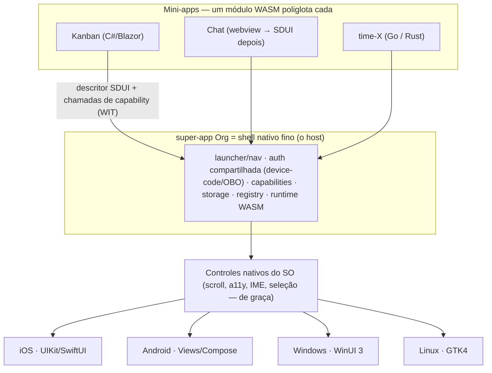

# Mabel Framework

> [Read in English](README.md)

**O Mabel é uma plataforma de super-app poliglota.** Um app é publicado no device; as
funcionalidades são **mini-apps WASM** — um por projeto/time — que uma **casca (shell)
nativa fina** renderiza como **controles nativos de verdade do SO**. Cada time escreve na
sua própria linguagem; todos os mini-apps falam o mesmo contrato semântico de UI. **Sem
WebView. Sem reimplementar o SO num canvas. E sem Mac pra publicar no iPhone.**

---

## O panorama: a plataforma de super-app da Org

> **Cada projeto/time da Org entrega o seu mini-app; o super-app Org renderiza todos.**

Há **um único app Org** no device. As features não são telas hard-coded — são **mini-apps**
independentes (cada um = um módulo WASM + um descritor de UI), de times diferentes, que o
shell carrega e renderiza. Adicionar ou corrigir uma feature = publicar um mini-app novo,
**sem reinstalar** o app (ver [OTA](docs/ota.md)).

**Pilares:**

- **Um app, muitas features.** Org é o app; Kanban, Chat e o que cada time construir são
  mini-apps dentro dele. Crescem sem passar de novo pela loja.
- **Poliglota por time.** Cada time no seu stack — Ledger em .NET/Blazor, outro em Go/Rust —
  e **todos emitem o mesmo descritor SDUI**. A plataforma democratiza; não obriga ninguém a
  adotar .NET (ver [autoria poliglota](docs/autoria-poliglota.md)).
- **Compartilhado pelo super-app.** Identidade/auth (device-code/OBO — login **uma vez**,
  todos os mini-apps herdam), capabilities (câmera/GPS/notif via WIT), storage, e o
  launcher/navegação entre mini-apps.
- **Sandbox por mini-app.** Cada mini-app roda isolado no seu próprio sandbox WASM — um
  projeto não lê a memória nem quebra o outro; autoridade só pelo que o manifesto concede.
  O modelo de segurança certo pra código de muitos times num app.
- **Registry de mini-apps.** O shell lista e carrega os mini-apps publicados — baked no
  build (compatível com loja) ou dinâmico interno (enterprise/MDM).

Design completo: **[docs/super-app.md](docs/super-app.md)** · **[ADR 0005](docs/adr/0005-super-app.md)**.

---

## O mecanismo: WASM como "DLL universal"

Uma DLL é um artefato compilado que qualquer programa carrega e chama por uma ABI estável,
seja qual for a linguagem que a escreveu. O Mabel aplica isso a **apps inteiros**:

> **Um mini-app é um único `.wasm`.** Agnóstico de linguagem (poliglota), sandboxed,
> portátil. O shell o carrega e fala dois contratos com ele: um **descritor de UI** (o que
> mostrar) e uma **ABI de capabilities** (o que o device pode fazer). O shell renderiza o
> descritor com os controles nativos da própria plataforma.



---

## Como funciona, de ponta a ponta

1. **Você escreve a UI** numa linguagem de alto nível. No caminho .NET, é **Blazor/Razor**
   (`.razor`) com um renderer custom que emite um descritor em vez de HTML.
2. **Compila pra um módulo WASM** — sandboxed, portátil, sem runtime de browser.
3. **O mini-app emite um descritor SDUI** — uma *árvore semântica de controles* ("uma lista
   rolável de cards, cada um com título e barra de progresso"), **não** um display-list de
   pixels.
4. **O shell carrega o módulo** e percorre o descritor com um `MabelViewBuilder`,
   instanciando **controles nativos de verdade** daquele SO.
5. **A interação volta semântica:** um controle tocado devolve `{action, id, data}` — nunca
   coordenadas de pixel. Scroll, foco, acessibilidade, seleção de texto, IME e Dynamic Type
   vêm **de graça**, porque são controles nativos de verdade.
6. **O mini-app alcança o device** via capabilities: uma ABI descrita em WIT media câmera,
   GPS, notificações, biometria, secure-storage, share, clipboard, haptics.

### SDUI: descritor semântico → controles nativos (não canvas, não WebView)

Outros frameworks ou reimplementam a stack de UI inteira num canvas (Flutter) ou embrulham
um WebView (Ionic, Tauri). O Mabel não faz nenhum dos dois: manda uma **descrição
semântica** e deixa cada SO renderizar nativamente. O descritor é uma árvore versionada
(`Mabel.Wasi.Protocol/Sdui/Descriptor.cs`) com 13 tipos de nó (v1):

`Screen · VStack · HStack · ScrollView · List · Card · Text · Button · Image · Badge ·
ProgressBar · Divider · Spacer`

Cada nó tem um **`Id` semântico e estável** (ex.: `card:50231`), props de layout flex-like,
estilo de caixa/texto e um `OnTap` opcional. Ver **[ADR 0001](docs/adr/0001-sdui-descriptor.md)**.

### Sem Mac, nunca — iOS via xtool

Publicar no iPhone normalmente exige um Mac (Xcode). A trave dura do Mabel é **sem Mac — por
princípio, zero toolchain Apple** (não é só "não comprar Mac"). Isso descarta MAUI, Flutter,
Compose Multiplatform, Uno e BlazorBindings.Maui pro iOS — todos exigem Mac/Xcode. Em vez
disso, o host iOS é **Swift hand-rolled (UIKit/SwiftUI)**, buildado e assinado a partir do
Linux/WSL com **[xtool](https://github.com/xtool-org/xtool)**. Um IPA hello-world já foi
buildado e instalado assim.

### Runtimes: o que roda de fato no device

O iOS proíbe JIT, e um spike provou exatamente o que roda onde:

| | Runtime | JIT? | HMR? | Linguagem do guest no device | Status |
|---|---|---|---|---|---|
| **iOS (dev & live)** | **WasmKit** (interpretador puro-Swift) | Não | Sim | **só lean core-wasm** (Rust/TinyGo/AssemblyScript/C) | **PROVADO no device, sem Mac** |
| **iOS (release, rápido)** | wasm2c → C → arm64 (AOT) | AOT | Não | lean core-wasm | aspiracional (não provado) |
| **Desktop** | wasmtime (Cranelift JIT) | Sim | Sim | amplo, **incl. .NET/Blazor** | desenhado |
| **Android** | wasmtime-JNI / Chicory (JIT) | Sim | Sim | amplo | desenhado |

> **Achado importante e honesto (spike, task #17):** **`.NET → wasm` não roda no WasmKit.**
> O .NET emite um Component WASI-Preview-2 + Mono; o WasmKit é um runtime core-module +
> Preview-1 → mismatch de formato, rejeitado. Então o **guest live-on-iOS é um lean
> core-wasm**, não .NET. **O papel do .NET/C#/Blazor é autoria, geração de descritor em
> build-time** (ex.: o `board_gen` roda no build/WSL e emite JSON de descritor — é assim que
> a tela iOS provada hoje funciona) **e desktop/Android** (runtimes JIT que rodam .NET-wasm).
> A promessa poliglota é real, com esse asterisco por plataforma.

### Alvos

- **Mobile:** **iOS** (host UIKit/SwiftUI, via xtool) e **Android** (host Views/Compose).
- **Desktop:** **Windows** (WinUI 3) e **Linux** (GTK4). Desktop é o **loop primário de HMR**
  (JIT, sem device). Ver **[docs/desktop.md](docs/desktop.md)** / **[ADR 0004](docs/adr/0004-desktop.md)**.
- **Adiado / bloqueado:** **macOS-desktop** (bloqueado pelo princípio sem-Mac — entra depois
  como só mais um host). **Web** (host SDUI→DOM) é conceitualmente possível, mas não perseguido.

---

## Arquitetura de super-app

O shell é um **host multi-módulo**: carrega e gerencia o ciclo de vida de **vários**
mini-apps (carregar sob demanda, descarregar, hot-swap), cada um emitindo seu descritor
SDUI, todos renderizados pelos mesmos controles nativos. Provê **serviços compartilhados** —
identidade/auth, capabilities, storage (compartilhado + por-mini-app), navegação, e
mensageria entre mini-apps mediada pelo shell (eles nunca se enxergam direto; o sandbox
segura).

**Incorporando o Chat:** o caminho rápido é um **mini-app webview** (o Chat já é web →
hospedado numa `WKWebView`/`WebView2` ao lado dos mini-apps SDUI-nativos, reusando a web de
hoje com a auth/capabilities do shell), migrando pra SDUI-nativo depois. Um super-app
**misto** (uns mini-apps SDUI-nativos, outros webview) é suportado. O webview aqui é uma
casca por-mini-app opcional, **não** a arquitetura do app — a tese "sem WebView" vale pro
Mabel-nativo.

Design completo: **[docs/super-app.md](docs/super-app.md)** · **[ADR 0005](docs/adr/0005-super-app.md)**.

---

## Atualização em runtime / OTA

Como o shell é estável e os mini-apps são conteúdo, features podem ir **over-the-air**. Três
níveis (design completo: **[docs/ota.md](docs/ota.md)** · **[ADR 0006](docs/adr/0006-ota.md)**):

| Nível | O que muda | Lógica nova? | OTA interno | App Store pública |
|---|---|---|---|---|
| **1. Descritor-only** | UI/conteúdo (a árvore SDUI, textos, layout, dados) | Não — dado puro | ✅ sempre seguro | ✅ ok (é dado, não código) |
| **2. Mini-app WASM (lógica)** | um `.wasm` novo/atualizado, rodado pelo **interpretador** | Sim | ✅ livre | ⚠️ cinza (ver abaixo) |
| **3. Shell nativo** | o host/app em si | Sim (nativo) | ❌ só loja | ❌ só loja |

**A tensão AOT-vs-OTA (explícita):** AOT (baked) dá velocidade nativa mas congela o mini-app
no build → **não é OTA**. O **interpretador** (WasmKit, provado no device) carrega módulos em
runtime → **habilita OTA de lógica**, mais lento. Estratégia: **core AOT** (rápido, loja) +
**mini-apps novos/updates via interpretador OTA** (interno) + **descritor-OTA sempre** (mais
rápido, mais seguro, qualquer canal).

**Policy, honesto:** Org **enterprise/interno/MDM** = OTA livre (não passa por App Review).
A **App Store pública** (guideline **2.5.2**) restringe baixar código executável; **JS tem
carve-out** explícito (JSCore — por isso RN/CodePush/WeChat podem), **WASM rodado pelo teu
próprio interpretador não → zona cinza.** Saídas públicas seguras: descritor-OTA + mini-app
webview + mini-apps AOT-baked.

---

## Autoria poliglota

**O contrato é o descritor SDUI + o WIT — não o Blazor.** Blazor é só o jeito idiomático do
C# de produzir o descritor. Três camadas (design completo:
**[docs/autoria-poliglota.md](docs/autoria-poliglota.md)** · **[ADR 0007](docs/adr/0007-autoria-poliglota.md)**):

1. **Fonte única = WIT/schema** (descritor + capabilities, `package mabel:*`).
2. **Codegen (wit-bindgen) gera tipos + bindings de capability por linguagem** (C#, Go,
   Rust) — o grosso de "falar o protocolo" é gerado, não escrito à mão.
3. **Açúcar de autoria idiomático por linguagem:**
   - **C# (flagship):** Blazor/Razor + renderer custom → descritor (referência = fork do
     **BlazorBindings**, retarget do backend MAUI→SDUI — **não** o MAUI).
   - **Go:** builders idiomáticos (`VStack(Card(...))`) ou lib estilo templ/gomponents;
     TinyGo→wasm.
   - **Rust:** macros/RSX, ou adaptar Dioxus/Leptos (já produzem árvore virtual); Rust→wasm.

Um **SDK-guest fino por linguagem** (tipos gerados + loop de render + açúcar) sobre um **core
compartilhado** (host/renderer/capabilities/shell). Prioridade: **C#/Blazor primeiro** (time
Ledger, melhor DX); Go/Rust habilitados publicando o WIT + o gerador. A arquitetura
**permite** os três; não **obriga** os três no dia 1. (Ressalva on-device: o guest live-iOS
é lean-lang, não .NET — ver a tabela de runtimes acima.)

---

## Capabilities

Mini-apps são sandboxed (zero acesso direto ao SO). APIs nativas são alcançadas por uma **ABI
capability-based**, modelada em **WIT** (`Mabel.Wasi.Protocol/Capabilities/wit/`,
`package mabel:capabilities`) como north-star, com o **wire real sendo um core-module WASI
Preview 1 achatado** hoje. Pontos-chave (**[ADR 0002](docs/adr/0002-capabilities-abi.md)**,
**[docs/capabilities-abi.md](docs/capabilities-abi.md)**):

- **Async por request-id + callback único** (não futures do Component Model — imaturos neste
  stack): o guest passa um `reqId`, recebe status na hora, e o host depois chama um export
  `mabel_on_capability_result(reqId, …)` → o guest resolve um `TaskCompletionSource` pra
  `await` idiomático.
- **Segurança em duas camadas:** um **manifesto** (o host só provê capabilities declaradas —
  least authority por construção) mais o **prompt de consentimento do SO** em runtime.
- **Conta Apple free** corta push e iCloud/keychain compartilhado; notificações são só locais,
  secure-storage é só por-app.

---

## Hot Module Reload + preservação de estado

O `mabel dev` observa arquivos, recompila o WASM e sinaliza o host por WebSocket; o host então
faz **hot-swap** do módulo e re-renderiza. Um módulo trocado ganha memória linear nova, então
o estado dentro do guest se perde a menos que seja transportado. A resposta em camadas
(**[docs/hmr-e-estado.md](docs/hmr-e-estado.md)** · **[ADR 0003](docs/adr/0003-hmr-e-estado.md)**):

- **Padrão — store de estado externalizado (Elm/TEA):** o app é `view(estado)` +
  `update(estado, ação)`; o estado vive num **store do host** e sobrevive ao swap por
  construção. A única opção que compõe com hot-swap **e** guests poliglotas, e já casa com o
  SDUI.
- **Transporte — snapshot** (`serialize_state`/`restore_state`) move o blob de estado opaco
  através do swap.
- **Otimização .NET — Roslyn Hot Reload** aplica deltas de IL in-place pra edições de corpo de
  método (sem swap, 100% preservado) — **só desktop/Android** (não iOS: o WasmKit não roda
  .NET-wasm).
- **Fallback — reload total** quando o shape do estado mudou incompatível.

Honesto sobre o que sobrevive: **dado puro** (tela/navegação/form/scroll/dados carregados)
sobrevive; **ligações vivas com o SO** (sessões de câmera, streams de GPS, sockets, timers,
chamadas de capability em voo) **não** — o host as encerra e o módulo novo re-subscreve.

---

## Desktop, e a decisão de toolkit

Desktop é alvo de 1ª classe e o loop primário de HMR (runtime JIT, sem device). **Não existe
um toolkit único cross-desktop de controles nativos do SO**, então a escolha é explícita:

- **Nativo por-OS** (Windows = WinUI 3/Win32, Linux = GTK4/Qt, macOS = AppKit): controles
  100% nativos, honrando a tese — mas um view-builder por OS.
- **Toolkit cross-desktop de render próprio** (Avalonia/Qt): um host só, mas desenha os
  próprios controles (Skia-like) — não os controles do SO, o que rompe o princípio "controles
  nativos" (mesma razão pela qual o canvas foi rejeitado no mobile).

**Decisão (ADR 0004):** mirar **nativo por-OS onde importa — Windows e Linux primeiro (sem
Mac); macOS adiado pelo muro do Mac.** Avalonia é permitido como **preview/andaime** de host
único no bring-up, não como destino. Runtime: **wasmtime** (Cranelift JIT). Ver
**[docs/desktop.md](docs/desktop.md)**.

---

## Status — honesto, por plataforma

Legenda: **PROVADO** (roda, validado) · **DESENHADO** (spec/ADR, não construído) · **A-FAZER**
(não começado) · **BLOQUEADO** (trava externa).

O **contrato do descritor SDUI** e o **WIT de capabilities** são platform-neutral e
compartilhados: contrato **DESENHADO (v1 commitado)**. Peças por plataforma:

| Camada | iOS | Android | Windows | Linux | macOS | Web |
|---|---|---|---|---|---|---|
| Host renderiza descritor → controles nativos | **PROVADO**¹ | DESENHADO | DESENHADO | DESENHADO | BLOQUEADO² | A-FAZER |
| Runtime WASM (guest live no device) | **PROVADO** (WasmKit, lean-lang)³ | DESENHADO (JIT) | DESENHADO (wasmtime) | DESENHADO (wasmtime) | BLOQUEADO² | A-FAZER |
| Capabilities (ABI WIT) | DESENHADO | DESENHADO | DESENHADO | DESENHADO | BLOQUEADO² | A-FAZER |
| Build sem Mac | **PROVADO** (xtool) | N/A | N/A | N/A | BLOQUEADO² | N/A |
| HMR (hot reload) | DESENHADO (swap WasmKit) | DESENHADO | DESENHADO (loop primário) | DESENHADO (loop primário) | BLOQUEADO² | A-FAZER |
| Shell super-app (multi mini-app) | DESENHADO | DESENHADO | DESENHADO | DESENHADO | BLOQUEADO² | A-FAZER |

¹ descritor → UIKit com scroll + tap nativos validado no device (a prova do Kanban); o
sign-off final no device destrava o PR consolidado.
² bloqueado pelo princípio sem-Mac (precisa de toolchain Apple).
³ **só lean core-wasm** (Rust/TinyGo/AssemblyScript/C). **.NET-wasm não é suportado no
WasmKit** — .NET fica em autoria, geração de descritor em build-time, e desktop/Android.

---

## Como o Mabel se compara

| Framework | Renderização de UI | Linguagem do app | Build iOS sem Mac? | Super-app / OTA |
|---|---|---|---|---|
| **Mabel** | **Controles nativos do SO** (SDUI) | **Qualquer → WASM** (poliglota) | **Sim (xtool)** | **Sim (mini-apps WASM)** |
| Flutter | Engine própria (Skia canvas) | Dart | Não | add-to-app, sem modelo de sandbox |
| React Native | Controles nativos | JavaScript | Não | CodePush (OTA de JS) |
| .NET MAUI | Controles nativos | Só C# | Não | Não |
| Uno Platform | WinUI XAML em tudo | Só C# | Não | Não |
| Compose Multiplatform | Própria (Skia), nativo no Android | Só Kotlin | Não | Não |
| Kotlin Multiplatform | Nativo por plataforma (UI não compartilhada) | Só Kotlin | Não | Não |
| Tauri | WebView (HTML/CSS/JS) | Rust + front web | Não | assets web |
| WeChat mini-programs | WebView | Só JavaScript | (o app host é nativo) | Sim (mini-programs JS) |

O diferencial do Mabel é a **interseção**: *um módulo WASM poliglota* → *controles nativos de
verdade do SO* → *buildado sem Mac* → *como mini-app de super-app sandboxed*. Nenhuma outra
linha fica nos quatro pontos.

Tradeoff, dito com honestidade: o poder expressivo do SDUI é limitado ao conjunto de nós.
Visuais bespoke (gráficos desenhados à mão, UI estilo jogo) exigiriam estender o schema ou um
nó `Canvas` de escape — fora do escopo v1. O Mabel mira UI de app baseada em controles (forms,
listas, boards, dashboards).

---

## Status atual — provado vs. em design

**Provado / funcionando:**
- CLI (`mabel`, .NET 10 AOT), dev server (file-watch + reload por WebSocket), renderer com
  suíte de testes verde.
- IPA iOS **buildado e instalado a partir do Linux sem Mac** via xtool (hello-world).
- **WasmKit roda num iPhone físico via xtool, sem Mac** (spike #17) — interpretador
  puro-Swift, arm64, ~4.6 MB (gotcha: pin `swift-system` 1.5.0). Roda **lean core-wasm**;
  **.NET-wasm é rejeitado** (Preview-2/Mono vs core-module/Preview-1).
- Render de display-list de pixels no iOS (Core Graphics) — o spike que motivou o pivot pro
  SDUI. Preservado pra referência, **superseded** pelo SDUI.

**Em design (esta consolidação + branches irmãs):**
- **Descritor SDUI → UIKit nativo** (ADR 0001): schema commitado; view-builder iOS rascunhado
  em `feat/sdui-descriptor`; o tap-through no device é a prova do Kanban, sign-off final
  pendente.
- **ABI de capabilities** (ADR 0002), **HMR + estado** (ADR 0003), **Desktop** (ADR 0004),
  **Super-app** (ADR 0005), **OTA** (ADR 0006), **Autoria poliglota** (ADR 0007).

**Índice de ADRs:** [0001 SDUI](docs/adr/0001-sdui-descriptor.md) ·
[0002 Capabilities](docs/adr/0002-capabilities-abi.md) ·
[0003 HMR + estado](docs/adr/0003-hmr-e-estado.md) ·
[0004 Desktop](docs/adr/0004-desktop.md) ·
[0005 Super-app](docs/adr/0005-super-app.md) ·
[0006 OTA](docs/adr/0006-ota.md) ·
[0007 Autoria poliglota](docs/adr/0007-autoria-poliglota.md)

> Nota: os ADRs 0001/0002 vivem nas suas próprias branches (`feat/sdui-descriptor`,
> `feat/mabel-capabilities-abi`); 0003–0007 e este README estão em
> `feat/mabel-arch-consolidation`. Os links resolvem quando as branches forem integradas.

---

## Estrutura do projeto

```
mabel-framework/
  Mabel.sln
  src/
    Mabel.Wasi.Protocol/       # Contratos guest<->host
      Protocol.cs              #   display-list de pixels legado (referência; superseded pelo SDUI)
      Sdui/Descriptor.cs       #   árvore semântica SDUI (13 tipos de nó)  [ADR 0001]
      Capabilities/            #   WIT + ABI core-module achatada          [ADR 0002]
    Mabel.Renderer/            # ICanvas + MabelRenderer (caminho display-list legado)
    Mabel.Core/                # Features, Ports, Infrastructure (vertical slice + hexagonal)
      Features/DevServer/      #   servidor HTTP + WebSocket de hot-reload
    Mabel.Cli/                 # CLI `mabel` (AOT)
    Mabel.Host.Ios/            # host Swift (view-builder UIKit + runtime WasmKit)
  docs/
    adr/0001..0007             # architecture decision records
    sdui-*, capabilities-abi.md, hmr-e-estado.md, desktop.md, super-app.md, ota.md,
    autoria-poliglota.md
  samples/                     # hello-world, hello-world-ios
  tests/                       # Mabel.Core.Tests, Mabel.Renderer.Tests
```

Arquitetura: **vertical slice** (cada feature auto-contida em `Features/`) +
**hexagonal/ports-adapters** (todo I/O atrás de `IShellExecutor`/`IFileSystem`; fakes nos
testes). Só dois projetos .NET de app: `Mabel.Core` e o fino `Mabel.Cli`.

## CLI

```bash
mabel doctor            # Checa ambiente (ferramentas, PATH, detecção de WSL)
mabel setup             # Instala deps (.NET 10, Swift, xtool, WasmKit, wasmtime)
mabel create <nome>     # Faz scaffold de um projeto Mabel
mabel deploy [path]     # Builda e roda num device/emulador
mabel dev [path]        # Dev server com hot reload (estilo Expo)
mabel devices           # Lista devices conectados
mabel usb-help          # Guia de USB pra devices físicos
mabel version
```

Opções: `--platform/-p` (`ios`|`android`|`desktop`|`all`), `--bundle-id/-b`,
`--port/-P` (default 5555), `--verbose`.

## Começando

```bash
git clone https://github.com/dmarquezbh/mabel-framework.git
cd mabel-framework
chmod +x setup.sh && ./setup.sh          # .NET 10, Swift, xtool, runtimes wasm, tooling USB
export PATH="$HOME/.dotnet:$PATH"
dotnet run --project src/Mabel.Cli -- doctor
dotnet build && dotnet test
```

Desenvolvido e testado em **Linux / WSL2** (Ubuntu). Pra iOS-a-partir-do-Linux via USB, ver
`mabel usb-help`.

## Stack de tecnologia

- **.NET 10** — CLI (AOT), autoria Blazor, geração de descritor em build-time, renderer,
  protocolo, host desktop
- **WASM/WASI** — o módulo do mini-app; **WasmKit** (interpretador live iOS, guests lean-lang),
  **wasmtime** (JIT desktop/Android, incl. .NET-wasm)
- **WIT** — contratos de descritor + capability (`package mabel:*`), codegen wit-bindgen
- **Swift** (UIKit/SwiftUI) — host iOS · **WinUI 3 / GTK4** — hosts desktop
- **xtool** — build & deploy iOS a partir do Linux (sem Mac)
- **xunit v3** — testes

## Contribuindo

Contribuições bem-vindas — abra uma issue ou PR. Decisões de arquitetura ficam registradas
como ADRs em `docs/adr/`; leia o ADR relevante antes de propor mudanças num subsistema.

## Licença

MIT
