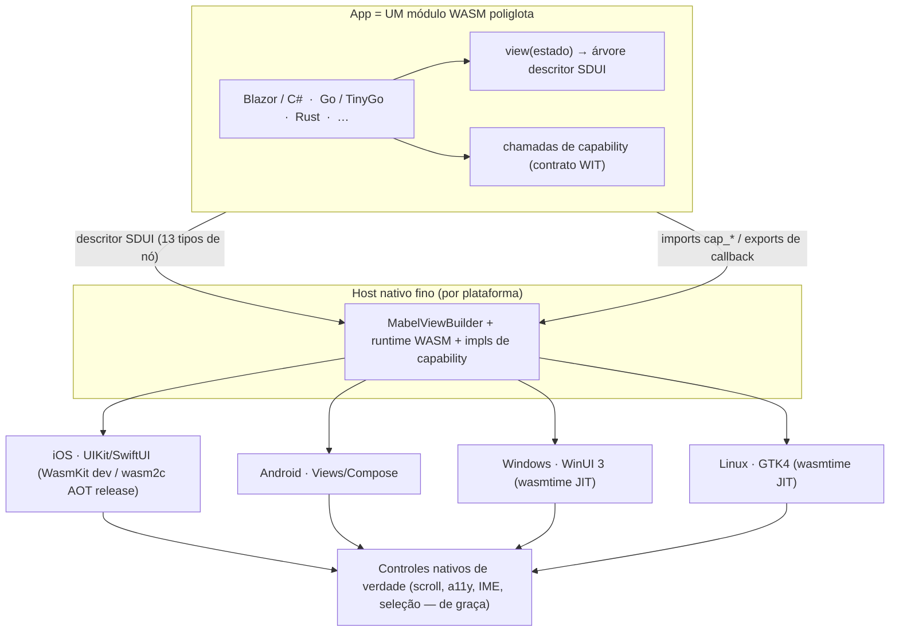

# Mabel Framework

> [Read in English](README.md)

O **Mabel** constrói apps multiplataforma — **mobile e desktop** — a partir de **um
único módulo WASM poliglota**. Você escreve o app uma vez (em C#/Blazor, Go, Rust, ou
qualquer linguagem que compile pra WebAssembly); um **host nativo fino** por plataforma
transforma um **descritor semântico de UI** em **controles nativos de verdade do SO**.
**Sem WebView. Sem reimplementar o SO num canvas. E sem Mac pra publicar no iPhone.**

---

## A tese: WASM como "DLL universal"

Uma DLL é um artefato compilado que qualquer programa carrega e chama por uma ABI
estável, independente da linguagem em que foi escrita. O Mabel aplica essa ideia a
**apps inteiros**:

> **O seu app é um único `.wasm`.** Ele é agnóstico de linguagem (poliglota), sandboxed
> e portátil. Cada plataforma entrega um host pequeno que carrega esse único módulo e
> fala dois contratos com ele: um **descritor de UI** (o que mostrar) e uma **ABI de
> capabilities** (o que o device pode fazer). O host renderiza o descritor com os
> controles nativos da própria plataforma.

Todo o resto do Mabel decorre dessa única ideia.



---

## Como funciona, de ponta a ponta

1. **Você escreve a UI** numa linguagem de alto nível. No caminho .NET, é **Blazor/Razor**
   (`.razor`) com um renderer custom que emite um descritor em vez de HTML.
2. **Compila pra um único módulo WASM** — sandboxed, portátil, sem runtime de browser.
3. **O guest emite um descritor SDUI** — uma *árvore semântica de controles* ("uma lista
   rolável de cards, cada um com título e barra de progresso"), **não** um display-list
   de pixels.
4. **Um host nativo fino carrega o módulo** e percorre o descritor com um
   `MabelViewBuilder`, instanciando **controles nativos de verdade** daquele SO.
5. **A interação volta semântica:** um controle tocado devolve `{action, id, data}` —
   nunca coordenadas de pixel. Scroll, foco, acessibilidade, seleção de texto, IME e
   Dynamic Type vêm **de graça**, porque são controles nativos de verdade.
6. **O app alcança o device** via capabilities: uma ABI descrita em WIT media câmera,
   GPS, notificações, biometria, secure-storage, share, clipboard, haptics.

### SDUI: descritor semântico → controles nativos (não canvas, não WebView)

Outros frameworks ou reimplementam a stack de UI inteira num canvas (Flutter) ou embrulham
um WebView (Ionic, Tauri). O Mabel não faz nenhum dos dois: manda uma **descrição
semântica** e deixa cada SO renderizar nativamente. O descritor é uma árvore versionada
(`Mabel.Wasi.Protocol/Sdui/Descriptor.cs`) com 13 tipos de nó (v1):

`Screen · VStack · HStack · ScrollView · List · Card · Text · Button · Image · Badge ·
ProgressBar · Divider · Spacer`

Cada nó tem um **`Id` semântico e estável** (ex.: `card:50231`), props de layout
flex-like, estilo de caixa/texto e um `OnTap` opcional. Ver **[ADR 0001](docs/adr/0001-sdui-descriptor.md)**.

### Sem Mac, nunca — iOS via xtool

Publicar no iPhone normalmente exige um Mac (Xcode). A trave dura do Mabel é **sem Mac**,
e é por isso que ele descarta MAUI, Flutter, Compose Multiplatform e BlazorBindings.Maui
pro alvo iOS — todos exigem Mac/Xcode. Em vez disso, o host iOS é **Swift hand-rolled
(UIKit/SwiftUI)**, buildado e assinado a partir do Linux/WSL com
**[xtool](https://github.com/xtool-org/xtool)**. Um IPA hello-world já foi buildado e
instalado assim.

### Dev vs Release: dois runtimes, um módulo

O iOS proíbe JIT, o que molda a história do runtime:

| | Runtime | JIT? | Hot reload? | Velocidade | Por quê |
|---|---|---|---|---|---|
| **Dev (iOS)** | **WasmKit** (interpretador, Swift) | Não | **Sim** | interpretado | Interpretador carrega/troca módulo em runtime → habilita HMR no device |
| **Release (iOS)** | **wasm2c → C → arm64** (toolchain do xtool) | AOT | Não | ~nativa | Sem Mac, sem JIT, quase velocidade nativa. HMR é só de dev |
| **Dev/Release (desktop)** | **wasmtime** (Cranelift JIT) | Sim | **Sim** | full | Desktop não tem o ban de JIT → o loop mais rápido |

O **mesmo** `.wasm`, descritor e WIT alimentam todos esses. (WASM-on-device — WasmKit +
xtool + .NET→wasm sem Mac — está sendo validado por um spike.)

### Alvos

- **Mobile:** **iOS** (host UIKit/SwiftUI, via xtool) e **Android** (host Views/Compose).
- **Desktop:** **Windows** (WinUI 3) e **Linux** (GTK4). Desktop é o **loop primário de
  HMR** (JIT, sem device). Ver **[docs/desktop.md](docs/desktop.md)** / **[ADR 0004](docs/adr/0004-desktop.md)**.
- **Adiado:** **macOS-desktop** (mesma trava do Mac — entra depois como só mais um host).

### Guests poliglotas

Como o contrato é WASM + descritor + ABI WIT — não um SDK de linguagem — o app pode ser
escrito em **qualquer linguagem que mire WASM/WASI**: C#/Blazor (principal), Go/TinyGo,
Rust e outras. O host não sabe nem se importa com qual delas produziu o módulo.

### Capabilities: o que o app pode fazer no device

O guest é sandboxed (zero acesso direto ao SO). APIs nativas são alcançadas por uma
**ABI capability-based**, modelada em **WIT** (`Mabel.Wasi.Protocol/Capabilities/wit/`,
`package mabel:capabilities`) como north-star, com o **wire real sendo um core-module
WASI Preview 1 achatado** hoje (mesmo padrão do canal de render). Pontos-chave
(**[ADR 0002](docs/adr/0002-capabilities-abi.md)**, **[docs/capabilities-abi.md](docs/capabilities-abi.md)**):

- **Async por request-id + callback único** (não futures do Component Model, imaturos
  neste stack): o guest passa um `reqId`, recebe status na hora, e o host depois chama
  um export `mabel_on_capability_result(reqId, …)`. O guest resolve um
  `TaskCompletionSource` → `await` idiomático.
- **Segurança em duas camadas:** um **manifesto** (o host só provê capabilities
  declaradas — least authority por construção) mais o **prompt de consentimento do SO**
  em runtime.
- **Conta Apple free** corta push e iCloud/keychain compartilhado (sem App ID pago);
  notificações são **só locais**, secure-storage é **só por-app**.

### Camada de autoria: Blazor sem MAUI

No caminho .NET você escreve componentes **Blazor/Razor**. Um **renderer custom**
transforma a árvore de componentes num descritor SDUI (usando o **BlazorBindings** como
referência de design — **não** o MAUI, que exige Mac). O Blazor é o front-end ergonômico;
o descritor é a saída portátil.

### Hot Module Reload + preservação de estado

O `mabel dev` observa arquivos, recompila o WASM e sinaliza o host por WebSocket; o host
então faz **hot-swap** do módulo e re-renderiza. O difícil é o **estado** — um módulo
trocado ganha memória linear nova, então o estado dentro do guest se perde a menos que
seja transportado. A resposta em camadas do Mabel (**[docs/hmr-e-estado.md](docs/hmr-e-estado.md)** / **[ADR 0003](docs/adr/0003-hmr-e-estado.md)**):

- **Padrão arquitetural — store de estado externalizado (Elm/TEA):** o app é
  `view(estado)` + `update(estado, ação)`; o estado vive num **store do host**, então
  sobrevive ao swap por construção. É a única opção que compõe com hot-swap **e** guests
  poliglotas, e já casa com o SDUI (o descritor é função pura do estado).
- **Transporte — snapshot** (`serialize_state`/`restore_state`) move o blob de estado
  opaco através do swap.
- **Otimização .NET — Roslyn Hot Reload** aplica deltas de IL in-place pra edições de
  corpo de método (sem swap, 100% preservado).
- **Fallback — reload total** quando o shape do estado mudou incompatível.

Honesto sobre o que sobrevive: **dado puro** (tela/navegação/form/scroll/dados
carregados) sobrevive; **ligações vivas com o SO** (sessões de câmera, streams de GPS,
sockets, timers, chamadas de capability em voo) **não** — o host as encerra e o módulo
novo re-subscreve.

---

## Como o Mabel se compara

| Framework | Renderização de UI | Linguagem do app | Build iOS sem Mac? |
|---|---|---|---|
| **Mabel** | **Controles nativos do SO** (SDUI) | **Qualquer → WASM** (poliglota) | **Sim (xtool)** |
| Flutter | Engine própria (Skia canvas) | Dart | Não (precisa Mac/Xcode) |
| React Native | Controles nativos | JavaScript | Não |
| .NET MAUI | Controles nativos | Só C# | Não |
| Uno Platform | WinUI XAML em tudo | Só C# | Não |
| Compose Multiplatform | Própria (Skia), nativo no Android | Só Kotlin | Não |
| Kotlin Multiplatform | Nativo por plataforma (UI não é compartilhada) | Só Kotlin | Não |
| Tauri | WebView (HTML/CSS/JS) | Rust + front web | Não |

O diferencial do Mabel é a **interseção**: *um módulo WASM poliglota* → *controles
nativos de verdade do SO* → *buildado sem Mac*. Nenhum outro framework da tabela fica nos
três pontos ao mesmo tempo.

Tradeoff, dito com honestidade: o poder expressivo do SDUI é limitado ao conjunto de nós.
Visuais bespoke (gráficos desenhados à mão, UI estilo jogo) exigiriam estender o schema
ou um nó `Canvas` de escape — fora do escopo v1. Se o seu produto é majoritariamente
pixel custom, um framework de canvas pode encaixar melhor; o Mabel mira UI de app baseada
em controles (forms, listas, boards, dashboards).

---

## Status atual — provado vs. em design

O Mabel é early. Esta seção é deliberadamente honesta.

**Provado / funcionando:**
- CLI (`mabel`, .NET 10 AOT), dev server com file-watch + reload por WebSocket, renderer
  com suíte de testes verde.
- IPA iOS **buildado e instalado a partir do Linux sem Mac** via xtool (hello-world).
- Render de display-list de pixels no iOS (Core Graphics) — o spike que motivou o pivot
  pro SDUI (um canvas não tem scroll/a11y/IME de graça). Preservado pra referência,
  **superseded** pelo SDUI.

**Em design (esta consolidação + branches irmãs):**
- **Descritor SDUI → UIKit nativo** (ADR 0001): schema commitado; view-builder iOS
  rascunhado em `feat/sdui-descriptor`; ainda não provado no device.
- **ABI de capabilities** (ADR 0002): WIT + contratos + modelo de manifesto; só design.
- **HMR + estado** (ADR 0003) e **host desktop** (ADR 0004): design nesta branch.

**Em validação (spike):**
- **WASM-on-device**: interpretador WasmKit + xtool + .NET→wasm num iPhone físico, sem
  Mac. Este spike destrava o runtime de dev, o HMR-no-iOS e o caminho release wasm2c.

**Índice de ADRs:** [0001 SDUI](docs/adr/0001-sdui-descriptor.md) ·
[0002 Capabilities ABI](docs/adr/0002-capabilities-abi.md) ·
[0003 HMR + estado](docs/adr/0003-hmr-e-estado.md) ·
[0004 Desktop](docs/adr/0004-desktop.md)

> Nota: os ADRs 0001 e 0002 hoje vivem nas suas próprias branches
> (`feat/sdui-descriptor`, `feat/mabel-capabilities-abi`); 0003/0004 e este README estão
> em `feat/mabel-arch-consolidation`. Os links resolvem quando as branches forem integradas.

---

## Estrutura do projeto

```
mabel-framework/
  Mabel.sln
  src/
    Mabel.Wasi.Protocol/       # Contratos guest<->host
      Protocol.cs              #   display-list de pixels legado (referência; superseded pelo SDUI)
      WasiContract.cs          #   nomes das funções de render
      Sdui/Descriptor.cs       #   árvore semântica SDUI (13 tipos de nó)  [ADR 0001]
      Capabilities/            #   WIT + ABI core-module achatada          [ADR 0002]
        wit/                   #     mabel:capabilities (camera, location, ...)
        CapabilityContract.cs  #     wire p1 achatado
        CapabilityManifest.cs  #     modelo do manifesto de capabilities
    Mabel.Renderer/            # ICanvas + MabelRenderer (caminho display-list legado)
    Mabel.Core/                # Features, Ports, Infrastructure (vertical slice + hexagonal)
      Features/DevServer/      #   servidor HTTP + WebSocket de hot-reload
    Mabel.Cli/                 # CLI `mabel` (AOT)
    Mabel.Host.Ios/            # host Swift (view-builder UIKit + runtime WASM)
  docs/
    adr/0001..0004             # architecture decision records
    sdui-*, capabilities-abi.md, hmr-e-estado.md, desktop.md
  samples/                     # hello-world, hello-world-ios
  tests/                       # Mabel.Core.Tests, Mabel.Renderer.Tests
```

Arquitetura: **vertical slice** (cada feature auto-contida em `Features/`) +
**hexagonal/ports-adapters** (todo I/O atrás de `IShellExecutor`/`IFileSystem`; adapters
reais em `Infrastructure/`, fakes nos testes). Só dois projetos .NET de app: `Mabel.Core`
e o fino `Mabel.Cli`.

## CLI

```bash
mabel doctor            # Checa ambiente (ferramentas, PATH, detecção de WSL)
mabel setup             # Instala deps (.NET 10, Swift, xtool, wasmtime, WasmKit)
mabel create <nome>     # Faz scaffold de um projeto Mabel
mabel deploy [path]     # Builda e roda num device/emulador
mabel dev [path]        # Dev server com hot reload (estilo Expo)
mabel devices           # Lista devices conectados
mabel usb-help          # Guia de USB pra devices físicos
mabel version
```

Opções: `--platform/-p` (`ios`|`android`|`desktop`|`all`), `--bundle-id/-b`,
`--port/-P` (default 5555), `--verbose`.

## Começando

```bash
git clone https://github.com/dmarquezbh/mabel-framework.git
cd mabel-framework
chmod +x setup.sh && ./setup.sh          # .NET 10, Swift, xtool, runtimes wasm, tooling USB
export PATH="$HOME/.dotnet:$PATH"
dotnet run --project src/Mabel.Cli -- doctor
dotnet build && dotnet test
```

Desenvolvido e testado em **Linux / WSL2** (Ubuntu). Pra iOS-a-partir-do-Linux via USB,
ver `mabel usb-help`.

## Stack de tecnologia

- **.NET 10** — CLI (AOT), autoria Blazor, renderer, protocolo
- **WASM/WASI** — o módulo do app; **WasmKit** (interp. dev iOS), **wasm2c→arm64** (AOT
  release iOS), **wasmtime** (JIT desktop)
- **WIT** — contratos de capability (`package mabel:capabilities`)
- **Swift** (UIKit/SwiftUI) — host iOS · **WinUI 3 / GTK4** — hosts desktop
- **xtool** — build & deploy iOS a partir do Linux (sem Mac)
- **xunit v3** — testes

## Contribuindo

Contribuições bem-vindas — abra uma issue ou PR. Decisões de arquitetura ficam
registradas como ADRs em `docs/adr/`; leia o ADR relevante antes de propor mudanças num
subsistema.

## Licença

MIT
